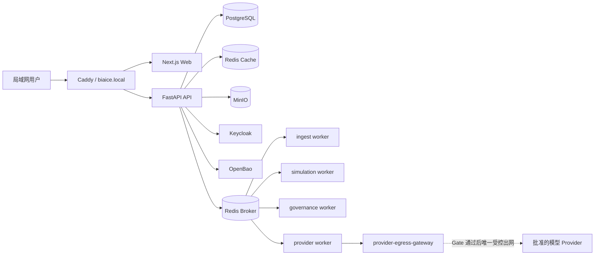

# 标策 AI（Biaice）

标策 AI 是面向采购投标团队的本地自托管决策辅助系统。应用、身份、数据库、对象存储、队列、OCR、审计与监控均运行在组内电脑或局域网设备上；生成式模型仅能由租户管理员配置 API Key 后，经服务端受控网关调用已批准的外部 Provider。

> 当前阶段：**M0 平台与契约骨架**。仅允许合成或脱敏测试数据；真实数据模式、真实 API Key、Provider 出网、正式推荐、审批与提交能力默认关闭。当前代码不代表 Production 准入。

## 核心边界

- 单仓库、模块化单体 API，加独立 Celery Worker；不拆成七个微服务。
- 标准 Next.js Node Web、FastAPI API、PostgreSQL、两个独立 Redis、MinIO、Keycloak、OpenBao、ClamAV 与 Caddy。
- `gateway` 是唯一局域网入口；浏览器、Web、API 与普通 Worker 不得直接访问 Provider。
- 不保证中标，不自动操作外部采购平台，不使用未授权竞对信息、个人信息或商业秘密。
- 未冻结契约、未通过 Gate 或状态未知时，正式能力失败关闭，只保留明确水印的安全探索或人工录入。

## 架构



## 仓库结构

```text
apps/web/                 Next.js App Shell、公共 UI、生成客户端与 feature 空挂载
apps/backend/             FastAPI、公共 core、治理编排与 Celery Worker
packages/contracts/       OpenAPI 快照、事件/错误目录与生成 TypeScript 类型
infra/                    Compose、网关、身份、密钥、数据库及可观测性配置
docs/                     PRD、ADR、架构、追踪、Stage Gate、安全与运行手册
scripts/                  Windows 初始化、运行、测试、备份与恢复入口
```

目录写入边界和集成规则见 [CONTRIBUTING.md](CONTRIBUTING.md) 与 [docs/architecture/ownership.yaml](docs/architecture/ownership.yaml)。成员 1 的交付范围、验证状态和回滚边界见 [M0 组长交接说明](docs/delivery/M0-member1-handoff.md)。

## 本地准备

- Windows 11 + PowerShell 5.1/7
- Docker Desktop（Compose v2）
- Node.js 22 LTS 或更高兼容版本
- Python 3.12
- uv（按锁文件建立 Python 开发环境）

运行 `scripts/init.ps1` 生成被 Git 忽略并收紧权限的 `.env.local` 合成开发配置；不得写入真实 API Key、OpenBao root token 或 unseal share。然后使用 `scripts/dev.ps1` 启动合成数据 profile。详细步骤见 [本地开发手册](docs/runbooks/development.md)。

## 开发与验证

```powershell
npm ci
uv sync --project apps/backend --locked --extra test
npm test
python scripts/validate_compose_topology.py
```

所有功能分支使用 `feature/m{成员号}-{domain}-{short-name}`。`main` 禁止直接开发；共享契约先合并，功能实现再依赖生成客户端。成员功能 PR 必须通过 CI、CODEOWNERS 与权限/审计负向测试；成员 1（组长）的公共平台和集成 PR 在四项必需 CI 全部通过、对话均已解决后可以直接 squash merge，但不得绕过 CI 或直接推送 `main`。

## 安全

本仓库公开，但业务数据、密钥与本机安全材料绝不能公开。提交前请阅读 [SECURITY.md](SECURITY.md) 与 [公开仓库安全基线](docs/security/public-repository.md)。发现漏洞请勿在公开 Issue 中披露利用细节。

## 需求基线

- `docs/标策AI_产品需求文档_PRD_V1.3.md`
- `docs/标策AI_项目构建完整提示词_V1.0.md`
- `docs/标策AI_前端设计文档_V1.0.md`（仅作交互参考）

本项目当前未授予开源许可证。公开可见不等于获得复制、修改或再分发许可。
