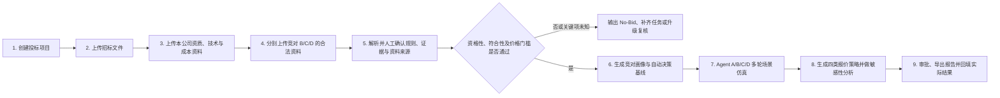
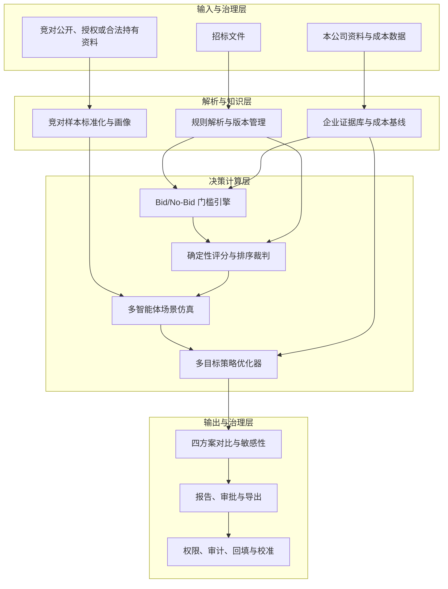

# 标策 AI 产品需求文档（PRD）

> 基于招标文件规则解析、企业能力核验、合规竞对画像和多智能体仿真的投标决策辅助系统

| 文档信息 | 内容 |
| --- | --- |
| 文档版本 | V1.1 |
| 文档状态 | 内部评审稿 |
| 产品形态 | Web 决策辅助系统 |
| 修订日期 | 2026-08-13 |
| 对齐基线 | 修正版前端 Demo（竞对资料输入、自动决策基线、四类策略方案） |
| 适用读者 | 产品、算法、前端、后端、招投标、商务、财务、法务与管理层 |

## 0. 本次修订说明

V1.1 以修正后的 Demo 为产品基线，重点修订如下：

1. 将输入体系由“招标文件 + 本公司资料”扩展为“招标文件 + 本公司资料 + 竞对公开或合法持有资料”三类输入。
2. 增加竞对 B、C、D 独立档案、历史投标样本标准化、报价区间与评分区间预测。
3. 将报价、成本、利润率等参数从“用户手工试填”改为“系统从资料与企业策略中自动形成决策基线”，人工只做有权限、有理由、有审计记录的修正。
4. 将单一推荐报价扩展为四类策略：平衡推荐、胜率优先、期望利润优先、利润保护。
5. 明确区分“中标概率”“数据完整度”“模型置信度”，禁止把预测结果表达为保证中标。
6. 补充竞对资料的来源、授权、商业秘密、反串标与数据留存要求。
7. 明确当前 Demo 仅演示交互和逻辑：上传文件只登记文件信息，规则解析、竞对画像和概率结果均为模拟数据，不代表真实项目结论。

---

## 1. 产品概述

### 1.1 一句话定义

标策 AI 将项目招标文件解析为可执行的评标规则，将本公司材料映射为可核验的资格与得分证据，再根据合法取得的竞对历史资料形成概率画像，通过多智能体场景仿真生成多套报价策略，帮助企业在资格合规、评分竞争力和利润要求之间做可解释决策。

### 1.2 核心结论

- 全国不存在统一、适用于所有项目的投标评分表。
- 资格、技术、商务、服务或资质是否加分，只能以当前项目招标文件为准。
- 所有报价优化必须先通过资格性、符合性、最高限价、异常低价等硬约束，再比较得分、胜率与利润。
- 竞对实际报价属于未知变量，产品只能基于公开、授权或企业合法持有的历史资料给出概率区间，不能准确断言对方本次报价。
- 多智能体用于企业内部情景推演，不代表真实竞争者，也不得用于联系竞争者、交换报价、协调投标或实施其他违法违规行为。
- 本产品是决策辅助工具，不承诺、不暗示“保证中标”。

### 1.3 产品价值

系统需要回答五个连续问题：

1. 该项目“必须满足什么”，哪些条件不满足会直接废标？
2. 该项目“如何得分”，每项分值、权重、公式和证据是什么？
3. 本公司现有资料能否支撑资格与预计得分，还缺什么？
4. 竞对可能采用怎样的报价与能力组合，其不确定性有多大？
5. 在合法合规且满足公司利润底线的前提下，本公司有哪些报价方案，各自的胜率、利润和风险是什么？

---

## 2. 背景与问题

### 2.1 业务痛点

1. 招标文件篇幅长，资格条件、废标条款、评分表和价格公式分散，人工容易漏项。
2. 企业资质、案例、人员证书、技术方案和成本数据分散，无法快速形成逐条证据链。
3. 市场人员往往依赖经验猜测竞争者报价，历史项目之间又存在规模、时间、地区和评标办法差异。
4. 报价、预计得分、胜率、毛利和项目风险常由不同角色分别计算，缺少同一决策口径。
5. 单点推荐报价容易制造确定性幻觉，管理层看不到结果对成本变化、竞对行为和评分误差的敏感度。
6. 大模型若直接“判断谁中标”，容易忽略法定流程、硬性门槛和精确计算规则，且难以审计。

### 2.2 产品机会

产品将非结构化文档理解与确定性规则计算分层：大模型负责识别、分类、归纳和证据匹配；规则引擎负责门槛判断与评分公式；仿真引擎负责不确定性采样；策略引擎负责在约束下生成多个可比较方案。

---

## 3. 产品目标与非目标

### 3.1 产品目标

- 自动建立当前项目唯一有效的规则集，并保留原文定位与人工确认状态。
- 自动核验本公司资格、技术、商务、服务和成本证据，形成缺口与补齐任务。
- 从合规竞对资料中提取可比较历史样本，预测竞对本项目报价与得分的分布区间。
- 自动形成项目决策基线，减少依赖用户反复手填报价、利润率和主观分数。
- 通过 Agent A 与竞对 Agent B/C/D 的多轮仿真，估计不同报价下的相对中标概率。
- 同时生成多套报价方案，使用户在胜率、期望利润和利润安全垫之间选择。
- 所有结论可回溯到文件、规则版本、证据版本、模型版本、参数与仿真批次。

### 3.2 非目标

- 不提供保证中标、规避监管、围标、串标、陪标或操纵评标的能力。
- 不获取、推断或展示通过非法渠道取得的竞争者未公开报价、底价或商业秘密。
- 不把通用行业经验直接当作当前项目的正式评分标准。
- 不替代招投标负责人、法务、财务和管理层的最终审批。
- 不自动签章、提交投标文件或对外联系采购人、代理机构及竞争者。
- V1.1 不将大模型生成的主观分数直接作为正式决策依据。

---

## 4. 术语和范围边界

| 术语 | 定义 |
| --- | --- |
| 硬性门槛 | 不满足即无效投标、废标或无法进入评分的资格性、符合性与价格约束 |
| 评分因素 | 招标文件明确列出且可计算或评审的价格、技术、商务、服务等项目 |
| 企业证据 | 能证明本公司满足某项门槛或评分项的资质、案例、人员、方案、承诺、成本等材料 |
| 竞对资料 | 公开、授权或企业合法持有的中标公告、历史报价、资质能力、技术摘要等资料 |
| 竞对画像 | 对某一竞争者的报价倾向、能力得分、门槛风险及不确定性的版本化概率描述 |
| 中标概率 | 在已声明规则、数据和场景假设下，多轮有效仿真中 Agent A 排名第一的频率 |
| 模型置信度 | 系统对输入数据完整性、样本可比性及预测稳定性的综合评价，不等同于中标概率 |
| 论证区间 | 在满足约束且目标值接近最优时可供审批讨论的报价范围，不等同于统计置信区间 |
| 决策基线 | 系统从规则、企业资料、成本数据和公司政策中自动计算的成本、利润与风险参数快照 |

### 4.1 可能出现的评审类别

下列内容在不同项目中可能是门槛、加分项、扣分项或完全不相关，系统不得预设其必然加分：

| 类别 | 常见材料示例 | 系统处理要求 |
| --- | --- | --- |
| 企业资格 | 行业许可、资质等级、认证、信用与合规记录 | 先判断是门槛还是评分项，再检查有效期、范围和主体一致性 |
| 类似业绩 | 合同、验收证明、中标通知、客户评价 | 检查金额、行业、时间、项目类型及证明链是否符合原文口径 |
| 项目团队 | 项目经理、专业人员、证书、社保与履历 | 检查人员唯一性、证书有效期和投入承诺 |
| 技术方案 | 架构、实施方法、进度、质量、安全、创新 | 按评分细则拆解响应点，不以通用模板代替项目要求 |
| 服务能力 | SLA、驻场、售后、培训、应急与网点 | 检查可履约性及承诺成本，不鼓励无法兑现的高承诺 |
| 商务条件 | 交付周期、付款条件、质保、偏离表 | 识别负偏离、无效响应和潜在现金流成本 |
| 政策因素 | 节能环保、中小企业、国产化、信息安全等 | 仅在适用法规和招标文件明确时进入计算 |

---

## 5. 用户角色与权限

| 角色 | 主要任务 | 关键权限 |
| --- | --- | --- |
| 投标负责人 | 建项目、确认规则、组织决策、选择方案 | 项目全局、提交审批、生成报告 |
| 标书专员 | 上传文件、核对条款、维护证据、处理缺口 | 文档与证据编辑，不可改财务底线 |
| 商务/售前 | 维护项目判断、技术响应和竞对公开资料 | 查看画像、补充来源、发起重算 |
| 技术负责人 | 确认技术能力、工作量、方案得分证据 | 技术证据确认与风险意见 |
| 财务/成本负责人 | 确认履约成本、税务口径、利润政策 | 成本基线审批、利润约束变更 |
| 法务/合规 | 审核资料来源、条款风险和投标合规性 | 冻结违规数据、查看全量审计日志 |
| 管理层/审批人 | 比较方案并作最终决策 | 只读全局、审批或驳回方案 |
| 系统管理员 | 用户、权限、模型与数据保留策略 | 平台配置，不默认查看项目敏感正文 |

竞对档案、报价预测和成本基线均按最小权限原则控制；普通成员不得跨项目浏览不在其授权范围内的敏感资料。

---

## 6. 产品原则

1. **一项目一规则集**：所有门槛、评分和公式来自当前版本招标文件及其澄清、补遗文件。
2. **先门槛，后评分，再优化**：未通过硬约束时不得输出“可投”或推荐报价。
3. **证据优先**：本公司预计得分必须有证据支撑；未知项显示未知，不由模型虚构。
4. **区间优先于伪精确点值**：竞对报价、得分和中标概率必须展示范围、依据和不确定性。
5. **预测与规则分离**：规则引擎执行确定性公式，模型只提供结构化识别和概率输入。
6. **自动基线优先**：成本与利润约束优先从企业资料、成本系统和审批政策生成，不要求用户先猜数。
7. **多方案而非唯一答案**：至少展示四种目标函数下的可行方案和取舍。
8. **人机共决策**：关键规则、成本基线、资料来源和最终方案必须由相应责任人确认。
9. **全链路可追溯**：任何结论都能追踪到原文、数据来源、算法版本、运行参数和审批人。
10. **合规红线内运行**：仅使用公开、授权或合法持有的数据，不支持任何形式的报价协调或串通。

---

## 7. 端到端业务流程

### 7.1 流程说明

1. 用户创建项目并确定行业、采购品类、预算/最高限价、交付范围和时间信息。
2. 系统解析招标文件、澄清文件、补遗文件，形成版本化规则集。
3. 系统从企业资料库或本次上传材料中抽取资格、案例、人员、技术、服务和成本证据。
4. 用户将竞对资料分别归档至竞对 B、C、D；正式版支持 1 至 N 个竞争者。
5. 责任人确认关键门槛、评分公式、证据匹配与竞对资料的合法来源。
6. 规则引擎先执行 Bid/No-Bid 判断；关键规则未知时默认不进入正式策略审批。
7. 系统自动形成成本底线、最低可行报价、证据成熟度、竞争强度和画像置信度等基线。
8. 仿真引擎按竞对画像采样不同场景，裁判引擎逐轮计算有效性与排序。
9. 策略引擎生成四类方案；审批人对比后选择、驳回或要求重新取数。
10. 项目结束后回填公开结果和本公司复盘数据，供模型校准，不自动将未经核验的数据加入训练集。

---

## 8. 功能需求总览

| 编号 | 模块 | 优先级 | 修正版 Demo 状态 |
| --- | --- | --- | --- |
| FR-01 | 项目与三类资料输入 | P0 | 已演示；仅登记文件名、大小与归属 |
| FR-02 | 招标文件规则解析 | P0 | 预置模板与模拟解析结果 |
| FR-03 | 本公司证据与成本基线 | P0 | 模拟证据成熟度与成本数据 |
| FR-04 | 双向匹配与 Bid/No-Bid 门槛 | P0 | 已演示规则链路，非真实核验 |
| FR-05 | 竞对档案与资料治理 | P0 | 已演示 B/C/D 独立上传与资料计数 |
| FR-06 | 竞对画像与区间预测 | P0 | 已演示模拟画像、报价/得分区间和置信度 |
| FR-07 | 自动决策基线 | P0 | 已演示模拟自动推导值 |
| FR-08 | 多智能体场景仿真与规则裁判 | P0 | 已演示启发式抽样与排序 |
| FR-09 | 四类报价策略生成 | P0 | 已演示四方案及核心指标 |
| FR-10 | 方案对比、敏感性与压力测试 | P0 | 部分演示，正式压力测试待实现 |
| FR-11 | 决策报告、审批与导出 | P0 | 已演示 JSON 报告，正式审批待实现 |
| FR-12 | 数据合规、权限与审计 | P0 | 已展示边界提示，后台治理待实现 |
| FR-13 | 结果回填、复盘与模型校准 | P1 | 未实现 |

---

## 9. 详细功能需求

### FR-01 项目与三类资料输入

#### 9.1.1 输入分区

项目工作台必须明确区分：

1. **招标方文件**：招标文件、采购需求、工程量清单、评分办法、澄清与补遗。
2. **本公司资料**：企业资质、案例、人员、技术方案、服务承诺、成本测算和内部政策。
3. **竞对资料**：按竞争者独立存储的公开公告、历史投标结果、资质能力、技术摘要和合法内部记录。

#### 9.1.2 文件处理

- 正式版支持 PDF、DOCX、XLSX、图片扫描件及压缩包，使用 OCR 处理扫描文件。
- 记录文件哈希、来源、上传人、上传时间、密级、授权依据和解析状态。
- 同名或同哈希文件提示去重；补遗文件不得静默覆盖原规则，应创建新版本。
- 失败文件显示原因，可重新解析；不可解析内容允许人工录入并标记“人工来源”。
- 当前 Demo 不读取文件正文，仅用文件元数据触发模拟结果，页面必须持续显示该限制。

### FR-02 招标文件规则解析

系统至少抽取以下结构化内容：

- 项目基本信息、标段、预算、最高限价、工期/交期、付款与质保条件。
- 资格性要求、符合性要求、无效投标/废标条款、签章与文件格式要求。
- 评标方法，如综合评分法、最低评标价法或招标文件定义的其他办法。
- 价格、技术、商务、服务等评分项的分值、权重、计算公式、舍入规则和并列处理规则。
- 评标基准价、价格扣除、政策加分、异常低价审查、成本说明与澄清要求。
- 所有评分项所需证明材料、有效期、主体、格式及原件/复印件要求。

每条规则必须包含：规则类型、结构化表达、原文摘录、文件名、页码/章节、置信度、确认人、确认时间和生效版本。低置信度、公式冲突或补遗覆盖必须进入人工复核队列。

### FR-03 本公司证据与成本基线

#### 9.3.1 证据库

- 将企业材料拆分为可复用证据单元，包括资质、认证、案例、人员、技术能力、服务能力和承诺。
- 记录证据主体、适用范围、有效期、证明链、密级和责任部门。
- 自动识别过期、即将过期、主体不一致、范围不匹配或证明链不完整的材料。

#### 9.3.2 成本基线

- 从 ERP、成本模板或经财务审核的文件中提取人工、软硬件、采购、分包、差旅、税费、资金占用、质保与风险准备等成本。
- 自动统一含税/不含税口径、币种和项目周期，形成版本化履约成本基线。
- 从公司政策库取得最低利润、现金流、账期和风险约束，并注明政策版本。
- 无可靠成本数据时不得输出正式利润结论，只可显示“待财务确认”的情景结果。
- 人工修正只作为例外操作，必须填写理由、影响范围并重新触发财务审批。

### FR-04 双向匹配与 Bid/No-Bid 门槛

系统执行两条匹配链：

- **规则找证据**：每项门槛与评分项是否有本公司材料支撑。
- **证据找规则**：每份材料实际支持了哪些条款，避免无效堆料或遗漏引用。

每项输出“满足、部分满足、不满足、未知”之一，并展示证据、原文、负责人和补齐截止时间。

Bid/No-Bid 判断顺序固定为：

1. 主体与资格性门槛。
2. 文件完整性与实质性响应。
3. 法定或文件规定的价格约束。
4. 异常低价及成本可解释性。
5. 公司内部最低利润、现金流与履约风险约束。
6. 通过后才进入评分与策略仿真。

若关键项为“不满足”或无法在投标截止前补齐，系统输出 No-Bid；若关键项为“未知”，输出“暂停决策并复核”，不得直接给出胜率优先方案。

### FR-05 竞对档案与资料治理

#### 9.5.1 档案结构

- Demo 固定展示竞对 B、C、D；正式版支持 1 至 N 个竞争者及“未知竞争者”聚合画像。
- 每个竞对拥有独立名称、统一社会主体标识、别名、行业标签、区域、关联历史项目与画像版本。
- 文件必须归属到明确竞对；不确定归属的文件进入待确认区，不能直接参与训练或仿真。

#### 9.5.2 允许的数据

- 政府采购、公共资源交易等合法公开平台发布的中标/成交公告和结果明细。
- 竞争者公开披露的资质、案例、产品、团队与服务能力信息。
- 企业经合同、授权或合法业务流程持有的历史投标记录。
- 已去敏且经法务批准的内部竞争情报。

#### 9.5.3 禁止的数据和行为

- 与竞争者交换、协调或探询本项目拟报价、投标意向或投标方案。
- 上传窃取、泄露、绕过权限取得的报价、底价、评委信息或商业秘密。
- 根据系统建议实施围标、串标、陪标、轮流中标或市场分割。
- 将来源不明的数据默认为真实；此类数据应隔离并触发合规复核。

系统必须保存来源 URL/文件、取得方式、授权依据、采集时间、可用目的、保留期限和审核状态。法务可冻结或删除违规数据，并使依赖该数据的画像与报告自动失效。

### FR-06 竞对画像与区间预测

#### 9.6.1 样本标准化

系统需按项目品类、规模、区域、时间、采购方式、评标办法、最高限价和工作范围判断历史样本可比性，并进行价格指数、含税口径和规模差异标准化。不可比样本不得强行纳入。

#### 9.6.2 画像输出

每个竞对至少展示：

- 预测报价中心、主要区间及尾部风险区间。
- 预测价格分、技术/商务/服务非价格分和总分区间。
- 资格或符合性风险、异常低价倾向、常见报价位置与行为变化信号。
- 有效资料数、可比历史样本数、最近样本日期和数据覆盖率。
- 模型置信度、区间宽度、关键假设、主要证据和画像版本。

系统不得将预测中心标记为“竞对本次报价”。样本少、项目差异大或近期策略漂移时，必须扩大区间、降低置信度，并允许退化为行业/未知竞争者画像。

#### 9.6.3 处理流程

竞对资料处理顺序为：文档分类 → 事实抽取 → 主体归一 → 历史价格标准化 → 能力证据映射 → 当前项目评分映射 → 不确定性估计 → 人工复核 → 发布画像版本。

### FR-07 自动决策基线

系统自动生成并展示以下基线及其来源：

- 预测履约成本与成本区间。
- 公司最低利润保护比例和最低可行报价。
- 本公司资格通过状态、非价格得分区间和证据成熟度。
- 竞对画像综合置信度、预计竞争强度和未知竞争者占比。
- 当前项目价格上限、价格评分关键拐点和异常低价风险区间。
- 现金流、交付、账期、质保和成本波动风险。

基线卡片必须区分：

- **招标文件规则**：不可由普通用户改写。
- **企业内部约束**：来自财务或管理制度，可由授权人审批调整。
- **模型估计**：带置信度和区间，可在新数据加入后重算。

页面默认不要求用户先输入报价和利润率。确需覆盖时，用户必须选择数据来源、填写理由，并可随时恢复到自动基线。

### FR-08 多智能体场景仿真与规则裁判

#### 9.8.1 智能体角色

| 智能体 | 输入 | 作用 |
| --- | --- | --- |
| Agent A：本公司策略智能体 | 已确认规则、本公司证据、成本基线和候选策略 | 在约束内生成候选报价与响应水平 |
| Agent B/C/D：竞对画像智能体 | 各自画像版本、历史行为分布和当前项目特征 | 在每轮仿真中抽样报价、得分和门槛状态 |
| 规则裁判 | 已确认规则集、各智能体本轮输出 | 确定性执行门槛、评分公式、排序和并列规则 |

规则裁判不是生成式智能体，不得仅凭自然语言“感觉”判断胜负。所有价格分、总分和排序须由可测试的公式引擎完成。

#### 9.8.2 仿真要求

- 支持配置仿真轮数、随机种子、画像版本和场景权重，保证结果可复现。
- 每轮从竞对区间分布抽样，并考虑报价与非价格能力之间的相关性。
- 支持竞对缺席、新进入者、无效投标、异常低价审查和策略漂移场景。
- 无效投标轮次单独统计；缺少必要规则的轮次不得混入正式中标概率。
- 输出 Agent A 排名分布、第一名概率、与第二名差距、失标原因分布及不确定性分解。

### FR-09 四类报价策略生成

通过硬约束后，策略引擎至少生成以下四类方案：

| 方案 | 优化目标 | 必须满足的约束 | 适用情形 |
| --- | --- | --- | --- |
| 平衡推荐 | 在中标概率、期望利润、风险和结果稳健性之间取得综合最优 | 全部门槛、最低利润、审批政策 | 默认推荐与管理层综合决策 |
| 胜率优先 | 在满足最低利润和风险边界下最大化模拟中标概率 | 不得突破成本与利润底线 | 战略客户、重点样板项目；页面须标注“不保证中标” |
| 期望利润优先 | 最大化风险调整后的期望利润 | 最低可接受胜率、利润和履约约束 | 更关注组合投资回报时 |
| 利润保护 | 优先提高利润安全垫并控制成本波动风险 | 可配置最低竞争力阈值 | 成本不确定、账期长或履约风险高时 |

每个方案至少输出：

- 建议报价点与论证区间。
- 模拟中标概率及其波动范围。
- 预计收入、贡献毛利、毛利率和风险调整后的期望利润。
- 本公司预计总分与价格分、相对第二名的分差分布。
- 关键约束余量、主要失标原因、成本敏感度和竞对敏感度。
- 适用条件、不适用条件、数据依据、置信度和待审批项。

若没有同时满足规则与公司底线的报价，系统只输出“无可行方案”及原因，不得为了展示四张卡片而放宽约束。

### FR-10 方案对比、敏感性与压力测试

- 支持四方案并排比较并将某一方案应用到仿真竞技场。
- 自动测试成本上浮、竞对降价、竞对技术得分提升、未知竞争者加入和本公司某项证据失效等场景。
- 展示报价变化对价格分、中标概率、毛利和期望利润的曲线或关键拐点。
- 明确“中标概率高但置信度低”“期望利润高但尾部亏损大”等冲突。
- 用户可调整场景假设，但页面应优先展示系统基线与调整差异，不将手工试数作为主流程。
- 任一规则、成本或画像版本变化后，旧方案标记为过期，需重新计算。

### FR-11 决策报告、审批与导出

决策报告至少包含：

1. 项目与规则集版本、关键门槛和评标方法。
2. 本公司资格结论、证据覆盖、预计得分与缺口任务。
3. 成本基线、利润政策、审批状态和数据时间点。
4. 各竞对资料来源、画像版本、报价/得分区间和置信度。
5. 多智能体仿真配置、有效轮数、结果和主要失标原因。
6. 四类方案对比、所选方案、选择理由与敏感性分析。
7. 数据限制、模型限制、合规声明和未决问题。
8. 制表、复核、财务、法务与最终审批记录。

Demo 提供 JSON 导出；正式版应支持可审计 JSON、PDF 和 XLSX，并允许对外版隐藏竞对敏感信息。任何导出文件都需带项目水印、版本号和生成时间。

### FR-12 数据合规、权限与审计

- 对招标文件、本公司材料、成本数据和竞对资料分别设置密级与访问权限。
- 静态存储和传输均加密；预览、下载、导出、重算和删除均写入不可篡改审计日志。
- 模型服务不得默认保留项目文件用于通用训练；外部模型调用需满足企业数据协议。
- 支持按项目、资料来源和法定/合同期限执行保留与删除策略。
- 报告必须包含“仅供内部决策参考，不构成中标保证”的显著声明。
- 对疑似串标关键词、来源不明的竞争者机密或异常批量导出触发合规告警。

### FR-13 结果回填、复盘与模型校准

- 项目结束后录入本公司是否投标、实际报价、资格结果、得分、中标结果和公开竞对结果。
- 将预测区间与实际结果对比，计算报价区间覆盖率、得分误差和概率校准指标。
- 区分模型误差、规则解析误差、成本误差、竞对突变和不可观察因素。
- 数据需经责任人确认后才能加入后续画像或模型校准集。
- 支持按行业、采购类型、评标方法和时间窗口回测，不跨不可比场景盲目复用。

---

## 10. 决策与计算逻辑

### 10.1 硬约束

候选报价 \(p\) 必须同时满足：

\[
\text{QualificationPass}=1
\]

\[
\text{CompliancePass}=1
\]

\[
p \leq \text{TenderPriceCap}
\]

\[
p \geq \text{CompanyMinimumFeasibleBid}
\]

以及招标文件中的异常低价、政策扣除、报价完整性和其他明确约束。硬约束失败时不计算正式推荐排名。

### 10.2 竞对历史报价标准化

当历史项目存在可比最高限价时，可使用报价相对位置作为特征：

\[
r_{i,j}=\frac{\text{HistoricalBid}_{i,j}}{\text{HistoricalPriceCap}_{i}}
\]

再结合项目规模、范围、区域、时间和评标方法建立条件分布。若最高限价缺失，可使用经验证的基准价或单位规模价格；无法可靠换算的样本应剔除，而不是填补为看似精确的数字。

### 10.3 本公司与竞对得分

- 本公司非价格分来自已确认的规则—证据映射，并以区间表示评委主观项的不确定性。
- 竞对非价格分来自其画像和证据覆盖分布。
- 所有价格分按当前项目已确认公式逐轮计算。
- 评分舍入、政策扣除、缺项扣分、并列排序等必须严格执行当前规则版本。

### 10.4 模拟中标概率

设有效仿真轮数为 \(N\)，则候选报价 \(p\) 下的模拟中标概率为：

\[
P_{win}(p)=\frac{1}{N}\sum_{k=1}^{N}I(\text{Agent A 在第 }k\text{ 轮有效且排名第一})
\]

该数值仅对当前数据、假设和版本有效。模型置信度需单独计算，不能因为 \(P_{win}\) 较高就自动显示“高可信”。

### 10.5 利润口径

正式版默认采用经财务确认的一致口径：

\[
\text{ContributionProfit}(p)=\text{NetBidRevenue}(p)-\text{AttributableDeliveryCost}
\]

\[
\text{RiskAdjustedExpectedProfit}(p)=P_{win}(p)\times\text{ContributionProfit}(p)-\text{BidCost}-\text{RiskPenalty}
\]

Demo 中“期望利润”为简化模拟，不包含完整现金流、资金成本、投标沉没成本和尾部风险；正式版不得沿用简化值作为财务结论。

### 10.6 方案生成

策略引擎在可行报价空间中搜索各目标函数的候选最优点，再通过邻域压力测试形成论证区间。论证区间应满足：

- 所有硬约束持续成立。
- 目标值与最优值的差异在产品配置容忍度内。
- 成本或竞对小幅变化时不立即出现重大亏损或排名坍塌。
- 区间内不存在未披露的评分公式跳点或异常低价风险。

---

## 11. 核心数据对象

| 数据对象 | 关键字段 |
| --- | --- |
| Project | 项目、标段、行业、预算、最高限价、时间、状态、负责人 |
| SourceDocument | 文件类型、归属、哈希、密级、来源、授权、解析状态、版本 |
| RuleSetVersion | 生效文件、评标方法、状态、确认人、发布时间 |
| RuleClause | 门槛/评分/公式、原文定位、结构化表达、置信度、确认状态 |
| CompanyEvidence | 证据类型、主体、有效期、适用范围、证明链、密级 |
| EvidenceMatch | 规则、证据、匹配状态、预计得分、人工意见 |
| CostBaselineVersion | 成本构成、含税口径、区间、财务确认、政策版本 |
| Competitor | 主体标识、名称/别名、行业、区域、档案状态 |
| CompetitorSource | 竞对、资料类型、公开地址/授权依据、时间、可信等级、保留期 |
| HistoricalBidSample | 历史项目、报价、得分、结果、评标方法、原始来源 |
| ComparableSample | 标准化价格、可比权重、剔除原因、特征版本 |
| CompetitorProfileVersion | 报价/得分分布、风险、样本量、置信度、模型版本 |
| DecisionBaselineVersion | 成本底线、利润政策、证据成熟度、竞争强度、来源 |
| SimulationRun | 规则/画像/基线版本、随机种子、轮数、场景、结果摘要 |
| StrategyPlan | 目标类型、报价点、论证区间、胜率、利润、风险、约束余量 |
| DecisionReport | 所选方案、对比、意见、审批、导出版本 |
| AuditEvent | 操作人、动作、对象、前后值、时间、设备、理由 |

所有衍生对象必须记录其上游版本；删除或冻结上游数据时，依赖对象自动标记为失效。

---

## 12. 逻辑架构

### 12.1 技术职责边界

- OCR/文档模型：版面识别、表格与公式抽取。
- 大语言模型：条款分类、证据候选匹配、差异解释和报告草拟。
- 规则引擎：硬性门槛、精确评分、排序、舍入与并列处理。
- 统计/机器学习模型：竞对分布、相似项目、置信度与概率校准。
- 仿真引擎：抽样、场景组合、随机种子、结果聚合。
- 优化器：在硬约束下搜索多目标策略与稳健区间。
- 审计服务：版本、权限、审批、导出与数据生命周期。

---

## 13. Demo 与正式版边界

| 能力 | 当前修正版 Demo | 正式产品要求 |
| --- | --- | --- |
| 文件上传 | 浏览器登记文件名、大小和归属 | 安全存储、OCR、真实抽取、病毒扫描、解析任务 |
| 招标规则 | 三个预置项目模板与模拟结果 | 从项目文件提取并由人员确认的版本化规则集 |
| 本公司能力 | 模拟证据成熟度和成本基线 | 企业证据库、ERP/成本模板、有效期与财务审批 |
| 竞对档案 | B/C/D 独立上传入口和模拟资料计数 | 主体归一、来源治理、历史样本标准化与画像版本 |
| 竞对预测 | 根据模板和文件元数据生成模拟区间 | 经回测和校准的报价/得分概率分布 |
| 决策基线 | 使用 Demo 默认值自动推导 | 从规则、证据、成本系统及政策库自动形成 |
| 多智能体 | 启发式扰动、区间抽样和模拟排序 | 可复现的蒙特卡洛/场景仿真与确定性规则裁判 |
| 中标概率 | 演示性概率映射，未做统计校准 | 基于有效仿真、历史回测并展示校准误差 |
| 四类方案 | 已展示报价、区间、胜率、毛利和期望利润 | 完整财务口径、压力测试、审批与版本冻结 |
| 报告 | JSON 导出 | JSON/PDF/XLSX、脱敏版、数字水印和审批链 |
| 安全合规 | 页面提示 | RBAC、加密、审计、保留策略、合规告警与冻结机制 |

任何 Demo 演示或截图必须避免将模拟结果用于真实投标审批。

---

## 14. 非功能需求

### 14.1 可解释性与可审计性

- 100% 的硬性门槛结论可回溯到原文与证据。
- 每个方案可回溯至规则、成本、画像、算法、随机种子和审批版本。
- 任何人工覆盖必须展示覆盖前后差异和操作者。

### 14.2 准确性与可靠性

- 试点验证集中，硬性条款召回率目标不低于 98%；正式使用前仍须人工确认。
- 评分公式必须通过自动单元测试和人工样例复算，关键公式未确认时禁止正式仿真。
- 同一输入版本、随机种子和算法版本应得到可复现结果。
- 服务异常不得丢失原文件、确认状态或审批记录。

### 14.3 性能

- 普通项目上传后 5 秒内显示已接收状态和任务进度。
- 单份 200 页以内的可解析文件，目标在 10 分钟内生成初步结构化结果。
- 10,000 轮、10 个竞对以内的基础仿真，目标在 60 秒内返回摘要；复杂场景显示异步进度。

### 14.4 安全与隐私

- 传输与存储加密，敏感字段分级脱敏。
- 支持企业单点登录、角色权限、项目级隔离和导出水印。
- 成本、竞对和投标文件不得进入未经批准的第三方训练或遥测链路。
- 删除、冻结和法务保全需兼顾数据生命周期与审计要求。

### 14.5 易用性

- 首屏清楚展示当前阶段、必要输入、缺口和下一步。
- 所有概率旁展示口径、置信度、更新时间和“非保证”提示。
- 不以红绿单色传达唯一含义，满足基础键盘操作与可读性要求。

---

## 15. 产品指标

### 15.1 效率指标

- 从文件齐备到形成初步规则清单的时间。
- 人工核对招标文件和形成评分表的工时下降比例。
- 证据缺口从发现到关闭的平均时间。

### 15.2 质量指标

- 硬性条款召回率、误报率和公式复算通过率。
- 规则—证据匹配准确率与人工驳回率。
- 竞对实际报价落入预测区间的覆盖率及区间宽度。
- 竞对总分预测误差与行为漂移发现时效。
- 中标概率的 Brier Score、校准曲线及相对简单基线的改善。

### 15.3 业务指标

- 进入审批的项目中，四方案对比报告使用率。
- No-Bid 建议被采纳后避免的无效投标或低质量投标数量。
- 项目组合的实际贡献利润与投标前风险调整期望利润偏差。
- 复盘数据完整率和模型校准周期。

质量指标优先于单独追求“中标率”。中标率可能被项目筛选、战略性低价和样本偏差误导，不应作为唯一产品成功指标。

---

## 16. 迭代路线图

### 阶段 0：修正版 Demo（当前）

- 三类资料入口与 B/C/D 独立竞对档案。
- 模拟规则、画像、自动决策基线和多智能体对抗。
- 四类策略卡片、方案应用、竞技场与 JSON 报告。
- 明示模拟数据和合规边界。

### 阶段 1：真实文档与规则 MVP

- PDF/DOCX/XLSX/OCR 解析、条款定位和版本管理。
- 本公司证据库、规则双向匹配、Bid/No-Bid 门槛。
- 真实评分公式引擎、人工复核和基础审计。
- 成本模板上传及财务确认。

### 阶段 2：合规竞对情报与仿真 MVP

- 竞对主体、来源治理和历史项目标准化。
- 报价/得分区间模型、未知竞争者画像和模型置信度。
- 可复现蒙特卡洛仿真、四策略优化和敏感性分析。
- 内部试点，不用于无人复核的真实审批。

### 阶段 3：试点校准与企业集成

- 对接企业资料库、ERP/成本系统、SSO 和审批流。
- 历史回测、概率校准、策略漂移监控和模型注册。
- PDF/XLSX 报告、数据保留与合规告警。

### 阶段 4：生产化

- 多行业规则模板、可配置政策和 1 至 N 竞对。
- 高可用、灾备、渗透测试、模型风险管理和运营看板。
- 经法务、财务、招投标负责人共同签署生产准入标准。

---

## 17. 主要风险与控制措施

| 风险 | 影响 | 控制措施 |
| --- | --- | --- |
| 将模型结果误认为保证中标 | 错误决策、过度降价 | 强制显示模拟口径、置信度和不保证声明；最终人工审批 |
| 竞对资料来源不合法 | 法律、声誉与商业秘密风险 | 来源声明、授权审核、最小权限、冻结与失效传播 |
| 被用于串标或报价协调 | 严重合规风险 | 禁止对外协同功能、行为告警、审计与合规培训 |
| 历史项目不可比 | 竞对区间失真 | 可比性评分、剔除原因、分层建模和扩大不确定区间 |
| 竞对策略发生变化 | 预测漂移 | 时间衰减、漂移监控、压力场景和快速重算 |
| 招标规则解析错误 | 废标或错误评分 | 原文定位、人工确认、公式测试和关键项锁定 |
| 本公司证据或成本过期 | 虚高得分或利润亏损 | 有效期告警、财务审批、成本压力测试 |
| 概率未经校准 | 方案排序误导 | 历史回测、校准曲线、基线比较和置信度拆分 |
| 大模型幻觉 | 伪造条款或能力 | 未找到原文/证据即标记未知；规则计算不用生成式判断 |
| 敏感数据泄露 | 商业损失 | 项目隔离、加密、脱敏导出、水印和异常下载告警 |

---

## 18. MVP 验收标准

### 18.1 文档与规则

- 用户可在一个项目内分别上传招标文件、本公司资料和至少三个竞对档案资料。
- 系统能抽取并展示资格门槛、废标条款、评分项、权重、价格公式及原文定位。
- 澄清/补遗可形成新规则版本，旧结论自动标记过期。

### 18.2 企业核验

- 每条门槛和评分项均显示证据匹配状态；无证据时不得自动判定满足。
- 关键项不满足或未知时，系统停止正式报价推荐并给出补齐或复核任务。
- 成本和利润约束有明确数据来源、口径、版本和财务确认状态。

### 18.3 竞对画像

- B/C/D 资料严格隔离，每份资料带来源、授权与审核状态。
- 系统输出竞对报价与得分区间、样本数、更新时间和模型置信度，而非断言其真实本次报价。
- 非法、冻结或来源不明资料不能参与画像和仿真。

### 18.4 仿真与方案

- Agent A 与竞对 Agent 可按指定规则、画像版本、轮数和随机种子运行并复现结果。
- 确定性裁判先判断门槛，再计算得分和排名。
- 系统在无须用户预先手填报价和利润率的情况下生成平衡、胜率优先、期望利润优先、利润保护四类方案。
- 每个可行方案均显示报价点、论证区间、中标概率、置信度、毛利、期望利润、约束余量和主要风险。
- 无可行解时明确显示原因，不生成伪推荐。

### 18.5 报告与合规

- 报告完整记录数据来源、规则、证据、成本、画像、模型、仿真和审批版本。
- 用户可以对比方案并导出审计报告；导出内容带版本、水印和免责声明。
- 权限、下载、人工覆盖、重算和删除操作均可审计。

---

## 19. 待产品评审决策

1. 正式版竞对档案采用“项目内独立档案”还是“企业级竞对库 + 项目快照”；建议采用后者并做严格权限隔离。
2. 哪些公开平台、已购数据库和内部资料可被列入公司认可的数据来源白名单。
3. 企业最低利润、最低可接受胜率和风险惩罚由谁配置、按公司还是按业务线生效。
4. 四类方案的默认排序及“胜率优先”是否继续使用“稳妥中标”这一容易产生误解的名称。
5. 财务成本基线优先对接 ERP、项目预算系统，还是先采用标准 XLSX 模板。
6. 试点行业和评标方法范围；建议先选一个资料完整、历史结果公开且评分公式较稳定的细分品类。
7. 模型上线前需要达到的报价区间覆盖率、概率校准和人工复核门槛。
8. 是否需要设置合规官强制审批节点，以及哪些异常行为必须自动冻结项目。

---

## 附录 A：页面信息架构建议

1. 项目总览与决策状态。
2. 三类资料中心。
3. 招标规则与版本确认。
4. 本公司资格、证据、得分与成本基线。
5. 竞对 B/C/D 档案与画像。
6. 多智能体仿真竞技场。
7. 四类策略方案与敏感性分析。
8. 决策报告、审批和复盘。
9. 数据来源、权限和审计中心。

## 附录 B：报告强制免责声明

> 本报告基于指定版本的招标文件、企业资料、合法竞对历史资料及模型假设生成，仅用于企业内部投标决策辅助。竞对报价、得分和中标概率均为情景模拟，不代表真实投标结果，不构成任何形式的中标保证。使用者须遵守招投标、反不正当竞争、商业秘密和数据保护等适用要求，并由有权人员完成最终复核与审批。
