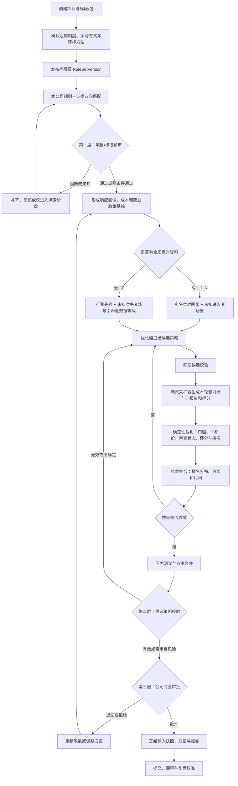
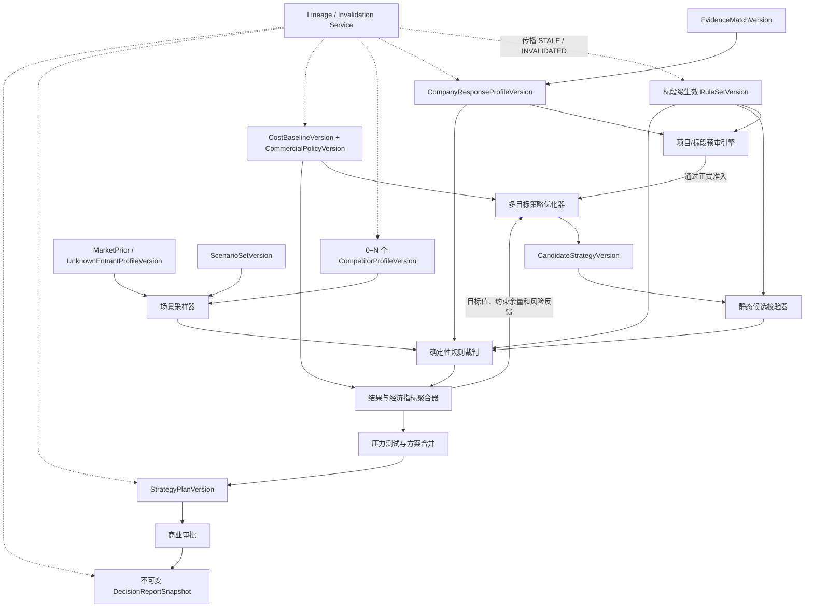

# 标策 AI 产品需求文档（PRD）

> 基于标段级规则解析、企业响应核验、合规竞对情景和可审计策略仿真的投标决策辅助系统

| 文档信息 | 内容 |
| --- | --- |
| 文档版本 | V1.2 |
| 文档状态 | 内部评审稿 |
| 产品形态 | Web 决策辅助系统 |
| 修订日期 | 2026-08-13 |
| 前序版本 | V1.1，作为历史基线保留，不静默覆盖 |
| 对齐基线 | 修正版前端 Demo + V1.1 逐步逻辑核查结论 |
| 适用读者 | 产品、算法、前端、后端、招投标、商务、技术、财务、法务与管理层 |

## 0. V1.2 修订摘要

V1.2 修复 V1.1 中会影响产品实现和验收的逻辑问题：

1. 增加“适用制度—采购方式—评标方法—标段规则”四级识别，避免混用政府采购货物服务、工程招投标和企业采购规则。
2. 将“一项目一规则集”改为“一决策单元一套当前生效规则集”，支持多标段、兼投不兼中和组合报价。
3. 正式产品支持 0–N 个实名竞对；竞对资料不是必经输入，无资料时使用行业先验和未知竞争者场景并降低数据等级。
4. 将单一 Bid/No-Bid 拆为项目预审、候选策略校验、公司商业审批三层结论。
5. 将异常低价定位为报价相关的确定性结果或待评委审查风险，不再在报价生成前预先判定通过。
6. 将“中标概率”收敛为“模拟排名第一频率”；只有经过前瞻冻结回测和校准后，才允许展示“校准后的第一候选概率”。
7. 区分合同报价、政策或公式调整后的评标价、不含税净收入和履约成本。
8. V1.2 第一阶段只优化报价；技术、服务和资源配置作为已确认的响应方案版本固定输入。联合优化作为后续能力。
9. 将架构修正为“优化器提案—场景采样—确定性裁判—结果聚合—反馈优化器”的闭环。
10. 四类目标若产生相同或近似方案允许合并，正式输出为 0–4 个不同且可行的方案。
11. 拆分 Demo、MVP-A、MVP-B、Pilot 和 Production 阶段验收，不再把全部能力混为一个 MVP。
12. 精确说明当前 Demo 是纯前端启发式演示，Softmax 份额不是多轮排名第一频率，固定价差也不是稳健区间。

---

## 1. 产品概述

### 1.1 一句话定义

标策 AI 将适用于当前标段或包件的招标规则解析为可执行规则集，将本公司材料映射为可核验响应证据，再利用公开、授权且符合允许用途的竞对历史资料或市场先验构造不确定场景，通过确定性规则裁判和多目标报价搜索，为企业生成可解释、可复现、可审批的投标策略。

### 1.2 产品需要回答的问题

1. 本项目及标段适用哪套制度、采购方式和评标方法？
2. 当前生效文件规定了哪些资格、实质性要求、评分因素、价格公式和授标规则？
3. 本公司现有响应方案和证据能否支持参加投标，还缺什么？
4. 本公司的合同报价、评标价、净收入、成本和利润分别是多少？
5. 在 0–N 个实名竞对与未知竞争者场景下，本公司不同报价的排名和风险如何？
6. 哪些报价方案同时满足招标规则、评委审查风险边界和公司商业政策？
7. 决策结论基于哪些文件、版本、假设、模型和审批？

### 1.3 核心边界

- 全国不存在统一、适用于所有项目的评分表。
- 当前招标文件决定项目具体评审规则，但若其内容疑似违反上位法、强制性规定或适用制度，系统必须告警并升级人工复核，不得静默照算或自行改写原文。
- 竞对是否参加、实际报价及最终得分均是未知变量；系统只能进行合规的概率或压力情景分析。
- 多智能体是内部计算抽象，不代表与真实竞争者互动，也不得用于交换报价、协调投标或实施围标串标。
- 系统不自动提交投标、不替代评标委员会、不替代公司财务、法务和管理层审批，也不承诺中标。

---

## 2. 产品目标与非目标

### 2.1 产品目标

- 建立决策单元级的适用制度与生效规则版本，保留依据、优先级和人工确认状态。
- 建立规则—证据双向链路，形成企业预审结论、非价格得分输入和缺口任务。
- 建立经财务确认的成本与商业政策基线，分离合同报价、评标价、净收入和利润。
- 支持 0–N 个实名竞对，并始终考虑未知进入者和竞对缺席场景。
- 使用可复现的场景仿真估计排名分布，而不是生成虚假的确定性对手报价。
- 在固定响应方案下搜索报价，形成 0–4 个不同且可行的目标方案。
- 对规则、证据、成本、竞对来源、模型、随机种子、方案和审批进行全链路版本追踪。
- 项目结束后使用结果公开前已冻结的预测进行回测和概率校准。

### 2.2 非目标

- 不保证、不暗示或宣传“稳妥中标”“必然中标”。
- 不获取、展示或利用通过非法渠道取得的底价、未公开拟报价、评委信息或商业秘密。
- 不建立竞争者员工个人行为画像，不推断未公开个人或商业敏感信息。
- 不将资格条件自动当成评分因素；是否可评分必须同时符合适用制度与招标文件。
- V1.2 第一阶段不联合优化技术方案、人员投入、服务等级和报价。
- 不允许生成式模型直接执行资格判定、精确评分、舍入或排名。
- 不允许成本未经财务确认时输出正式利润结论。

---

## 3. 适用范围与制度分流

### 3.1 决策层级

```text
采购项目 Project
└── 决策单元 DecisionUnit（标段、包件或独立授标单元）
    ├── 适用制度 ApplicableRegimeVersion
    ├── 当前生效规则 RuleSetVersion
    ├── 本公司响应方案 CompanyResponseProfileVersion
    └── 独立仿真、策略与审批
```

一个项目可含 1–N 个决策单元。项目级文件和规则可被标段继承，标段专属文件可以覆盖，但必须记录优先级、覆盖关系、生效时间和确认人。兼投不兼中、授标数量上限、组合报价等跨标段规则由独立对象维护。

### 3.2 制度识别

系统至少区分：

| 制度类别 | 常见场景 | 产品处理要求 |
| --- | --- | --- |
| 政府采购货物与服务 | 公开招标、邀请招标等 | 按政府采购适用法规、采购文件和政策执行；资格条件与评分因素分离 |
| 工程及与工程有关的货物服务招标 | 施工、勘察、设计、监理及相关采购 | 按招标投标法体系、行业与地方规则及招标文件执行 |
| 企业或其他组织采购 | 企业招标、询比价、自定义评审 | 按采购人制度与文件执行，同时进行适用法律和公平竞争风险提示 |
| 其他采购方式 | 竞争性磋商、谈判、询价等 | 使用对应流程、最后报价和评审规则，不套用公开招标流程 |

每个决策单元必须确认：制度体系、管辖地、采购方式、评标方法、适用政策、确认依据和适用时间。模型可以建议，责任人必须确认。关键制度未知或冲突时，只能进入探索分析，不能发布正式规则或策略。

### 3.3 规则优先级与合法性告警

- 系统按适用制度维护上位规则、项目招标文件、澄清补遗和标段文件的优先关系。
- 所有具体得分仍按当前生效采购文件计算。
- 发现资格条件被不当设置为评分项、评分标准无法量化、评标方法与采购方式冲突或其他疑似违法条款时，系统输出“规则合规风险”，交由法务或招投标负责人处理。
- 系统不得擅自删除、改写或替代采购文件条款；人工确认后可建立“按原文模拟”和“合规风险情景”两个视图。

---

## 4. 术语与状态

| 术语 | 定义 |
| --- | --- |
| 决策单元 | 可独立确定规则、报价、排名、授标和审批的标段或包件 |
| 合同报价 | 本公司提交并可能形成合同基础的投标金额 |
| 评标价 | 合同报价经算术修正、政策扣除或采购文件规定调整后用于价格评分或排序的金额 |
| 净投标收入 | 合同报价扣除税费及不属于企业收入的项目后的财务口径收入 |
| 硬性门槛 | 按适用制度和采购文件，不满足可能使投标无效或不能进入下一评审阶段的要求 |
| 项目预审 | 投标前对本公司参与准备条件的内部核验，不等同于正式资格审查结果 |
| 候选策略校验 | 对具体报价和响应版本执行价格上限、完整性、评标价及异常低价风险分析 |
| 商业审批 | 公司对利润、现金流、产能和履约风险作出的内部批准，不改变投标的法律有效性 |
| 模拟排名第一频率 | 在声明的概率场景中，本公司有效且排名第一的加权频率 |
| 第一候选概率 | 经前瞻冻结样本校准后，对成为第一中标候选人的概率估计；未校准时不得使用该名称 |
| 第一候选情景利润代理值 | 未建立最终获授模型时，以“本公司排名第一”代替“最终获授并签约”计算的条件经济指标；不是统计意义上的期望利润 |
| 数据等级 | 对来源合法性、数据充分度、样本可比性、公开结果覆盖和时效的分级 |
| 稳健报价区间 | 经邻域压力测试仍满足约束和目标容忍度的报价范围；当前 Demo 尚未实现 |

### 4.1 三层业务结论

| 结论对象 | 状态 | 含义 |
| --- | --- | --- |
| PrecheckAssessment | PASS / CONDITIONAL / BLOCKED / UNKNOWN | 本公司内部预审是否具备进入正式策略计算的条件 |
| CandidateValidation | VALID / VALID_WITH_REVIEW_RISK / INVALID / INDETERMINATE | 某个具体候选策略在规则和情景下的有效性或审查风险 |
| CommercialApproval | PENDING / APPROVED / CONDITIONAL / REJECTED / EXPIRED / INVALIDATED | 公司是否批准采用该策略 |

只有预审满足正式准入、候选策略有效或带已接受的审查风险、商业审批有效时，方案才可标记为 `RECOMMENDABLE`。利润底线未满足时应显示“公司政策下无可行方案”，不得表述为评标无效。

### 4.2 产物有效性

所有衍生产物独立维护：

- `CURRENT`：当前输入下有效。
- `STALE`：上游出现新版本，历史可查但不能用于新审批。
- `INVALIDATED`：上游被撤销、认定错误或违规，不得继续使用。
- `SUPERSEDED`：已有替代版本，旧版仍可复现。
- `ARCHIVED`：生命周期结束，仅供审计和复盘。

---

## 5. 用户角色与权限

| 角色 | 主要职责 | 关键权限 |
| --- | --- | --- |
| 投标负责人 | 建项目/标段、确认流程、选择和提交审批 | 项目全局、冻结输入、生成报告 |
| 标书专员 | 上传文件、核对条款、维护证据和缺口 | 文档与证据编辑，不可改财务政策 |
| 商务/售前 | 维护响应方案和合规竞对资料 | 补充来源、查看获授权画像、发起重算 |
| 技术负责人 | 确认技术响应、资源与主观评分区间 | 发布响应方案版本与风险意见 |
| 财务/成本负责人 | 确认成本、税务、现金流和利润政策 | 发布成本基线、商业审批 |
| 法务/合规 | 确认适用制度风险、资料用途和法务保全 | 隔离/冻结数据、查看全量审计 |
| 管理层/审批人 | 比较方案并作最终商业决策 | 审批、附条件批准或驳回 |
| 系统管理员 | 用户、权限、模型和保留策略 | 平台配置，不默认查看敏感正文 |

成本、竞对资料、个人信息和投标正文采用最小权限、项目/标段隔离和字段级脱敏。审批人与制表人应按企业内控要求分离。

---

## 6. 产品原则

1. **一决策单元一套生效规则**：规则属于标段/包件，不默认属于整个项目。
2. **先制度再规则**：先确认适用制度、方式和方法，再解析具体条款。
3. **规则与合规风险并存**：按原文计算，但对疑似违法或冲突条款显著告警。
4. **预审、策略校验、商业审批分离**：不混用“无效投标”和“公司不批准”。
5. **证据优先**：没有证据即显示未知或缺失，不由模型虚构满足或得分。
6. **竞对资料可选**：支持 0–N 个实名竞对，始终保留未知进入者场景。
7. **规则裁判确定性**：门槛、公式、舍入、并列和排序必须由可测试引擎执行。
8. **情景而非伪预测**：数据不足时展示未校准情景，不展示精确概率等级。
9. **不同财务与评标口径不混用**：合同报价、评标价、净收入和成本分别计算。
10. **不同目标可合并**：输出 0–4 个真正不同且可行的方案，不强制四张不同卡片。
11. **人机共决策**：制度、规则、证据、响应、成本和最终策略由相应责任人确认。
12. **全链路可追溯**：输入变化通过依赖关系传播失效，历史审批和报告不可覆盖。
13. **合规红线内运行**：只使用具有合法来源和允许用途的数据，不支持报价协调或串通。

---

## 7. 端到端业务流程



正式策略计算不得跳过制度、关键规则、公司响应证据或财务成本确认。探索沙盘可以使用未确认数据，但必须带显著水印，结果不能进入审批。

---

## 8. 功能需求总览

| 编号 | 模块 | 优先级 | 目标阶段 |
| --- | --- | --- | --- |
| FR-01 | 项目、决策单元与制度识别 | P0 | MVP-A |
| FR-02 | 三类资料输入与文档治理 | P0 | MVP-A / MVP-B |
| FR-03 | 标段级规则解析与合规告警 | P0 | MVP-A |
| FR-04 | 本公司证据、响应方案和成本基线 | P0 | MVP-A |
| FR-05 | 第一层：项目/标段预审 | P0 | MVP-A |
| FR-06 | 0–N 竞对档案、市场先验与资料治理 | P0 | MVP-B |
| FR-07 | 竞对画像、未知进入者与数据等级 | P0 | MVP-B |
| FR-08 | 决策基线与报价搜索空间 | P0 | MVP-B |
| FR-09 | 场景采样、规则裁判和指标聚合 | P0 | MVP-B |
| FR-10 | 多目标策略、压力测试和方案合并 | P0 | MVP-B |
| FR-11 | 第二层策略校验与第三层商业审批 | P0 | MVP-B / Pilot |
| FR-12 | 报告、版本血缘和失效传播 | P0 | MVP-A / Pilot |
| FR-13 | 权限、个人信息、删除和审计 | P0 | MVP-A / Production |
| FR-14 | 结果回填、回测、校准与漂移监控 | P0 | Pilot |

---

## 9. 详细功能需求

### FR-01 项目、决策单元与制度识别

- 项目下可创建 1–N 个标段、包件或独立授标单元。
- 记录各单元预算、最高限价、范围、截止时间和跨标段约束。
- 系统从文件建议制度、管辖地、采购方式和评标方法，并附原文与外部政策依据。
- 责任人确认后发布 `ApplicableRegimeVersion`；未知或冲突状态阻止发布正式规则。
- 适用制度或采购方式变化时，所有下游规则、评分和策略自动过期。

### FR-02 三类资料输入与文档治理

工作台区分：

1. 招标方文件：招标文件、需求、清单、评分办法、澄清与补遗。
2. 本公司资料：资质、案例、人员、响应方案、承诺、成本与内部政策。
3. 可选竞对资料：公开公告、可核验历史投标结果、公开能力材料和经审核的合法内部资料。

正式版支持 PDF、DOCX、XLSX、图片和压缩包，包含病毒扫描、OCR、解析队列和失败重试。每份资料记录哈希、主体、标段、来源、允许用途、最小必要性、密级、共享限制、保留期限、审核状态和生效时间。未审核资料先隔离，不能进入画像或仿真。

### FR-03 标段级规则解析与合规告警

系统至少抽取：

- 资格、实质性响应、无效投标、签章与格式要求。
- 预算、最高限价、报价组成、算术修正和政策价格调整。
- 评标方法、评分因素、量化指标、权重、公式、舍入和并列规则。
- 异常低价的明文规则、说明材料要求和无法确定的评委审查因素。
- 同品牌、核心产品、联合体、分包及跨标段授标规则。
- 付款、质保、工期/交期和其他会影响成本的合同条件。

每条规则包含制度依据、规则类型、结构化表达、原文、文件/页码/章节、优先级、覆盖关系、置信度和人工确认。资格条件能否进入评分必须按适用制度单独校验。公式冲突、无法量化、补遗覆盖或疑似违反强制规则时进入合规复核。

### FR-04 本公司证据、响应方案和成本基线

#### 9.4.1 证据与响应画像

- 将企业材料拆为资质、案例、人员、技术、服务和承诺等版本化证据。
- 执行规则找证据和证据找规则，状态为满足、部分满足、不满足或未知。
- 形成 `CompanyResponseProfileVersion`：资格准备状态、确定性非价格分、主观分区间、评分证据和响应方案版本。
- 本公司非价格分必须从该响应画像进入逐轮规则裁判，不只用于项目预审。
- V1.2 策略搜索期间响应方案固定；改变人员、技术承诺或服务等级必须发布新响应版本并重算成本和策略。

#### 9.4.2 成本与商业政策

- 成本包含人工、采购、软硬件、分包、差旅、税费、资金占用、质保、索赔和风险准备等。
- 统一含税/不含税、币种、周期和归属口径，形成 `CostBaselineVersion`。
- 最低利润、现金流、产能和风险偏好形成 `CommercialPolicyVersion`。
- 未经财务确认的成本只能用于探索沙盘；人工覆盖必须有理由并重新审批。

### FR-05 第一层：项目/标段预审

项目预审只判断本公司是否具备进入正式策略阶段的内部准备条件：

1. 制度与关键规则是否确认。
2. 主体资格和文件准备是否具备。
3. 实质性响应是否具备或能在截止前闭环。
4. 响应方案及其证据是否达到允许的准备状态。
5. 成本是否达到正式或探索计算所需确认等级。

输出 `PASS / CONDITIONAL / BLOCKED / UNKNOWN`，并显示阻断项、补齐任务和期限。`BLOCKED/UNKNOWN` 阻止正式推荐，但可按权限进入带水印的探索沙盘。

### FR-06 0–N 竞对档案、市场先验与资料治理

- 正式版允许 0–N 个实名竞对；Demo 固定 B/C/D 只是展示布局。
- 文件归属不确定时进入待确认区，不参与计算。
- 竞对资料必须有合法来源、允许用途、审核状态和保留期限；“公开”不自动等于可无限复用。
- 严禁利用窃取、泄露或绕过权限取得的拟报价、底价、评委信息和商业秘密。
- 严禁与竞争者交换报价、投标意向或方案，也不得将系统用于围标、串标、陪标或市场分割。
- 无实名资料时加载 `MarketPriorVersion` 和 `UnknownEntrantProfileVersion`；有实名资料时仍保留未知进入者场景。

### FR-07 竞对画像、未知进入者与数据等级

#### 9.7.1 样本处理

按项目类别、规模、范围、区域、时间、采购方式、评标方法、最高限价和结果公开完整度判断可比性。历史报价统一税务和规模口径。中标报价多、落标报价缺失造成的选择偏差必须披露，不能把公开样本当成完整竞争者行为。

#### 9.7.2 画像输出

每个画像至少展示：

- 参加当前项目的情景概率或压力假设，不能默认必然参加。
- 合同报价或标准化报价分布、非价格分分布及其相关性。
- 资格、符合性和异常低价审查状态的情景假设。
- 样本数、来源覆盖、最近样本、选择偏差和策略漂移。
- 数据充分度、样本可比性、区间历史覆盖率和数据等级。

“数据等级”不得简单等于各竞对置信度平均值。数据不足时扩大区间并显示“未校准情景”，不得把中心值表述为竞对本次真实报价。

### FR-08 决策基线与报价搜索空间

`DecisionBaselineVersion` 合并：生效规则、响应画像、成本、商业政策、竞对/市场画像、未知进入者假设和数据时间点。

V1.2 第一阶段的唯一优化变量为合同报价 \(b\)。响应方案 \(r\) 和成本版本 \(c\) 固定。系统自动建立候选搜索空间：

- 招标文件允许的报价区间与离散精度。
- 公司商业政策允许的探索范围。
- 政策扣除、算术修正和评标价公式的跳点。
- 异常低价确定性阈值或待审查风险区域。

普通用户无需先猜报价和利润率。覆盖自动基线必须选择来源、填写理由并产生新版本。

### FR-09 场景采样、规则裁判和指标聚合

#### 9.9.1 职责

| 组件 | 职责 |
| --- | --- |
| 多目标优化器 | 提出本公司候选报价，接收结果反馈并继续搜索 |
| Agent A | 候选策略在某一轮场景中的本公司投标实例，不承担优化器职责 |
| 场景采样器 | 抽样竞对是否参加、报价、非价格分、门槛和未知进入者 |
| 确定性规则裁判 | 按当前规则逐轮计算评标价、有效性、审查状态、得分、并列与排名 |
| 指标聚合器 | 聚合排名、风险和经济指标，并反馈给优化器 |

#### 9.9.2 仿真要求

- 概率场景与压力测试场景必须分开；只有具有可解释概率权重的场景进入频率计算。
- 记录输入快照、算法/模型版本、仿真轮数、随机种子和场景权重，保证可复现。
- Agent A 无效或被淘汰的概率轮次按失败计入分母；只有规则无法计算或运行失败的轮次排除并单独报告。
- 同时考虑竞对报价与非价格分的相关性，以及缺席、新进入、无效投标和策略漂移。
- 输出概率场景总权重、可计算覆盖率、有效计算轮数、排除轮数及原因、排名分布、进入候选名单频率、第一名频率上下界、失标原因和不确定性分解。

### FR-10 多目标策略、压力测试和方案合并

系统从可行报价中按四类目标寻找候选方案：

| 目标 | 定义 | 最低约束 |
| --- | --- | --- |
| 综合情景平衡 | 对标准化后的排名频率、第一候选情景利润代理值、稳健性和审查风险加权 | 权重由审批政策版本定义 |
| 模拟排名优先 | 最大化模拟排名第一频率 | 商业政策底线和风险上限 |
| 第一候选情景利润代理优先 | 未建立获授模型时最大化第一候选情景利润代理值；建立并校准获授模型后才可使用风险调整期望收益 | 最低排名竞争力和尾部亏损约束 |
| 条件利润保护 | 在满足最低排名竞争力、利润达标概率和尾部亏损约束下最小化条件尾部损失 | 阈值由商业政策版本确定 |

- 四种目标产生相同或在配置容差内近似的报价时合并展示，并列出其满足的多个目标。
- 正式输出为 0–4 个不同且可行方案；无可行方案时只说明原因。
- 对成本上浮、竞对降价、竞对能力提升、未知进入者和证据失效做压力测试。
- 稳健报价区间由邻域候选经硬约束、目标容忍度和压力测试形成，不得用固定价差伪装。

### FR-11 第二层策略校验与第三层商业审批

候选策略校验分别输出：

- 静态有效性：最高限价、报价完整性、算术修正等可确定规则。
- 评标价与得分结果。
- 异常低价状态：未触发、确定性触发、待评委审查风险或信息不足。
- `VALID / VALID_WITH_REVIEW_RISK / INVALID / INDETERMINATE`。

异常低价不得使用全国统一固定比例。若招标文件未规定确定性阈值，只能基于有效投标报价和履约能力进行情景风险分析，最终结论仍属于评委判断。

商业审批独立检查利润、现金流、产能、资源冲突和履约风险，输出 `PENDING / APPROVED / CONDITIONAL / REJECTED`。商业拒绝不改变候选投标在评标规则下的有效性。

### FR-12 报告、版本血缘和失效传播

报告至少包括：制度和规则版本、本公司预审与证据、响应方案、成本与商业政策、竞对和市场数据等级、仿真配置、排名结果、0–4 个方案、三层结论、压力测试、限制与审批。

所有衍生对象保存完整输入清单和哈希，以不可变版本及依赖 DAG 追踪：

- 新规则版本使证据匹配、响应画像、预审、仿真、方案和报告变为 `STALE`；错误或违规规则使其 `INVALIDATED`。
- 证据过期仅从受影响匹配向响应画像、预审、仿真、方案和报告传播。
- 成本或商业政策变化只使财务指标、优化结果、方案、审批和报告过期，不改变资格结论。
- 竞对来源被冻结时，相关画像、场景、仿真、方案和报告失效，但不影响本公司项目预审。
- 普通模型升级使旧结果 `SUPERSEDED`；只有模型缺陷或合规撤回才使结果失效。
- 已批准方案上游变化时，审批记录保持不可变，但适用状态变为过期或失效，禁止作为当前报告导出。

### FR-13 权限、个人信息、删除和审计

- 每份数据除合法来源外，还必须记录允许用途、最小必要性、保留期限和共享限制。
- 身份证件、社保、人员履历、证书、联系方式等按个人信息单独治理；公开信息也不得脱离合理目的无限复用。
- 默认脱敏证件号、电话和地址；正文查看、下载、导出和外部模型调用实行字段级权限与最小化。
- 外部模型默认不得训练或长期保留项目数据；记录服务商、处理区域、保留期限和调用日志。
- 竞对画像只面向企业历史行为，不建立员工个人行为画像。
- 数据状态为：待审核、可用、隔离、冻结、删除待执行、法务保全、已删除。
- 疑似违规资料立即隔离并排除出计算；法务保全优先于普通删除。
- 原文可依法删除或隔离，但保留不含正文和非必要个人信息的审计墓碑：对象 ID、操作/审批人、时间、依据和删除状态。
- 审计采用追加式记录，不可覆盖；更正产生新事件。
- 删除、冻结后依赖产物立即失效；已导出报告登记撤回状态，不静默改写。

### FR-14 结果回填、回测、校准与漂移监控

- 结果公开前冻结预测时间戳、输入、算法和输出，防止事后重算冒充预测。
- 回填本公司是否投标、实际合同报价、评标价、资格/符合性、分项分数、排名和公开竞对结果。
- 训练集与测试集按时间隔离，按制度、品类、评标方法和区域分层评估。
- 比较报价区间覆盖、排名第一频率的 Brier Score/ECE、简单基线和策略漂移。
- 竞对结果只使用公开且可核验数据，并披露落标报价缺失偏差。
- 未达到校准门槛时只展示“模拟排名第一频率”，不得升级为“第一候选概率”。

---

## 10. 决策与计算逻辑

### 10.1 变量和口径

V1.2 报价优化使用：

- \(b\)：合同报价。
- \(r\)：固定的本公司响应方案版本。
- \(c\)：固定的成本基线版本。
- \(k\)：概率场景。
- \(e_k\)：本公司在场景 \(k\) 下的评标价。

评标价由当前规则确定：

\[
e_k=T(b,\text{policy}_k,\text{correction}_k,\text{RuleSet})
\]

利润不得直接使用评标价。会计收入和现金流必须分开：

\[
R_{exTax}(b)=F_{revenue}(b,\text{tax},\text{pass-through items})
\]

\[
CF^{in/out}_{k}=F_{cashflow}(b,\text{payment terms},\text{delivery schedule},k)
\]

毛利率和会计利润使用不含税收入；账期、融资成本和资金占用使用现金流净现值。相同资金成本不得同时进入收入转换、履约成本和风险惩罚。

### 10.2 静态候选约束

候选报价必须满足可确定规则，如报价格式、离散精度和最高限价：

\[
b\leq \text{TenderPriceCap}
\]

公司商业政策不是投标有效性规则，而是推荐约束：

\[
\text{CommercialFeasible}(b,r,c)=1
\]

异常低价若依赖其他有效投标报价或评委判断，应输出场景相关审查状态，不作为全局静态布尔条件。

静态候选集合定义为：

\[
\mathcal B_0=\{b\mid StaticRulePass(b,r)=1\land BaselineCommercialPass(b,r,c)=1\}
\]

场景商业风险另以概率约束表示，例如：

\[
P(Margin_k\ge m_{min}\mid award)\ge 1-\alpha,\quad
CVaR_\alpha(L_k)\le L_{max},\quad
P(reviewRisk_k=1)\le \rho
\]

本公司在部分随机场景中失效属于风险结果并按失败计入，不要求候选报价在所有场景中都确定有效。

### 10.3 逐轮裁判

在每个场景 \(k\) 中，采样器先生成竞对参与、报价、响应分和门槛状态，裁判再按 `RuleSetVersion` 执行：

1. 资格或初步评审情景。
2. 符合性和报价完整性。
3. 算术修正、政策调整与评标价。
4. 异常低价确定性规则或待审查风险。
5. 价格和非价格得分。
6. 舍入、并列、同品牌及候选名单规则。

生成确定有效、待审查、确定无效、不可确定四类逐轮状态，以及 `rank_{A,k}`、`reviewRisk_{A,k}` 和失标原因。生成式模型不得覆盖裁判结果。

### 10.4 模拟排名第一频率

概率场景全集为 \(K_{prob}\)，权重为 \(w_k\)，可计算场景集合为 \(K_{calc}\)。首先报告可计算覆盖率：

\[
Coverage=
\frac{\sum_{k\in K_{calc}}w_k}
{\sum_{k\in K_{prob}}w_k}
\]

规则缺失造成不可计算时应阻断正式运行；系统失败应重试。覆盖率低于 `CommercialPolicyVersion` 设定的发布阈值时，只能展示探索结果，不能发布正式频率。

对确定有效的场景计算排名第一频率下界；把待评委审查且假定通过后排名第一的场景加入后得到上界：

\[
P^-_{rank1\mid calc}(b)=
\frac{\sum_{k\in K_{calc}}w_k I(\text{valid}_{A,k}=1\land \text{rank}_{A,k}=1)}
{\sum_{k\in K_{calc}}w_k}
\]

\[
P^+_{rank1\mid calc}(b)=
\frac{\sum_{k\in K_{calc}}w_k I((\text{valid}_{A,k}=1\land \text{rank}_{A,k}=1)\lor(\text{reviewPending}_{A,k}=1\land \text{rankIfPass}_{A,k}=1))}
{\sum_{k\in K_{calc}}w_k}
\]

本公司确定无效的可计算场景在分子为 0，但保留在分母中。待审查场景既不直接当成确定有效，也不从分母删除。未建立评委审查通过模型时，界面展示 \([P^-_{rank1},P^+_{rank1}]\)。压力测试场景不进入该概率分母。

未经前瞻回测校准时，界面称“模拟排名第一频率”；校准后可另输出：

\[
P_{candidate1}=Calibrate(P^-_{rank1},P^+_{rank1},\text{segment},\text{modelVersion})
\]

该值描述成为第一候选人的估计，不等同于最终签约中标概率。

### 10.5 利润与风险

场景 \(k\) 的获授后会计贡献利润和现金流净现值分别为：

\[
\Pi^{account}_k(b,r,c)=R_{exTax}(b)-C_{fulfillment,k}(r,c)
\]

\[
\Pi^{NPV}_k(b,r,c)=NPV(CF^{in}_k)-NPV(CF^{out}_k)
\]

其中：

\[
C_{fulfillment,k}=C_{delivery,k}+C_{awardOnly,k}
\]

`C_awardOnly` 只能包含未进入履约成本基线的获授后费用，例如中标服务费或保函费用。投标准备成本 \(C_{bid}\) 无论是否排名第一都发生。风险准备金若已进入场景成本，不得再次进入尾部风险或惩罚项。

第一候选不等于最终获授并签约。在没有经过验证的获授模型时，只能计算“第一候选情景利润代理值”：

\[
\widetilde E\Pi_{rank1}(b)=
-C_{bid}+
\frac{\sum_{k\in K_{calc}}w_k I(\text{valid}_{A,k}=1\land \text{rank}_{A,k}=1)\Pi^{account}_k}{\sum_{k\in K_{calc}}w_k}
\]

只有建立并校准场景获授概率 \(q^{award}_k=P(\text{最终获授并签约}\mid\text{场景状态、候选排名、制度规则})\) 后，才能计算风险调整期望收益：

\[
E\Pi_{award}(b)=
-C_{bid}+
\frac{\sum_{k\in K_{calc}}w_k q^{award}_k\Pi^{account}_k}{\sum_{k\in K_{calc}}w_k}
-\lambda CVaR_\alpha(L(b))
\]

利润率按会计口径计算：

\[
Margin_k=\frac{\Pi^{account}_k}{R_{exTax}(b)}
\]

财务报告必须同时展示会计贡献利润和现金流 NPV，不得混为一个“利润”。

### 10.6 多目标方案

- 模拟排名优先：

\[
b_{rank}=\arg\max_{b\in\mathcal B}P^-_{rank1}(b)
\]

- 第一候选情景利润代理优先；建立获授模型后才将目标替换为 \(E\Pi_{award}\)：

\[
b_{proxy}=\arg\max_{b\in\mathcal B}\widetilde E\Pi_{rank1}(b)
\]

- 条件利润保护：

\[
b_{protect}=\arg\min_{b\in\mathcal B}CVaR_\alpha(L(b))
\]

- 综合情景平衡：

\[
b_{balanced}=\arg\max_{b\in\mathcal B}
\left[aZ(P^-_{rank1})+\beta Z(\widetilde E\Pi_{rank1})+\gamma Z(RobustMargin)-\delta Z(P_{review})-\epsilon Z(CVaR)\right]
\]

权重 \(a,\beta,\gamma,\delta,\epsilon\) 非负且总和为 1。标准化边界、权重和阈值必须在运行前由 `CommercialPolicyVersion` 固定。

所有目标共享规则和商业约束。近似报价的合并容差、最低竞争力、尾部风险阈值和综合权重都属于 `CommercialPolicyVersion`，不得硬编码。

稳健报价区间由相邻可行报价集合构成，集合中的报价必须满足：规则有效、商业约束成立、目标值在最优容忍度内，并通过配置的压力测试。若条件不成立则只输出点值或“无稳健区间”。

### 10.7 后续联合优化

若后续允许改变响应方案，决策变量扩展为 \(x=(b,r)\)，必须同时重算：

\[
C=C(x),\quad S_{nonprice}=S(x),\quad P_{rank1}=P(x)
\]

在建立响应承诺—得分—成本联动模型并通过验证前，不得宣传“技术与报价联合最优”。

---

## 11. 核心数据对象

| 数据对象 | 关键字段 |
| --- | --- |
| ProcurementProject | 项目容器、采购人、时间、负责人 |
| DecisionUnit | 标段/包件、范围、预算、上限、生命周期、跨标段组 |
| ApplicableRegimeVersion | 制度、管辖地、采购方式、评标方法、依据、确认状态 |
| CrossLotConstraintVersion | 兼投不兼中、组合报价、授标上限 |
| SourceDocumentVersion | 哈希、类型、主体、标段、优先级、生效时间、密级、用途、保留状态 |
| RuleSetVersion / RuleClauseVersion | 决策单元、制度版本、规则、原文、公式、覆盖关系、确认状态 |
| CompanyEvidenceVersion / EvidenceMatchVersion | 证据、有效期、规则匹配、状态、分数依据 |
| CompanyResponseProfileVersion | 预审输入、响应方案、确定性得分、主观分分布 |
| CostBaselineVersion | 税务口径、成本构成、情景分布、财务确认 |
| CommercialPolicyVersion | 利润、现金流、产能、目标权重、合并容差和风险阈值 |
| PrecheckAssessmentVersion | 输入快照、状态、阻断项和任务 |
| Competitor / CompetitorSourceVersion | 企业主体、资料来源、允许用途、审核和保留状态 |
| CompetitorProfileVersion | 参与、报价、得分、门槛分布、数据等级和模型版本 |
| MarketPriorVersion / UnknownEntrantProfileVersion | 无实名或新增竞争者的回退情景 |
| DecisionBaselineVersion | 规则、响应、成本、政策和市场输入清单 |
| ScenarioSetVersion | 概率/压力类型、权重、参与模型、数据等级 |
| CandidateSearchSpaceVersion | 报价范围、精度、跳点、约束版本 |
| CandidateStrategyVersion | 合同报价、评标价映射、响应版本 |
| CandidateValidationVersion | 静态结果、审查风险、状态和原因 |
| SimulationBatchVersion / ScenarioOutcome | 输入、模型、种子、轮数、逐轮有效性和排名 |
| StrategyPlanVersion | 目标、报价、稳健区间、排名频率、利润、风险和约束 |
| CommercialApproval | 审批状态、条件、适用状态和责任人 |
| DecisionReportSnapshot | 冻结输入、方案、限制、审批和撤回状态 |
| DataLineageEdge | 上下游版本、依赖类型和影响范围 |
| InvalidationEvent / AuditEvent / TombstoneRecord | 失效、追加式审计和最小删除记录 |

---

## 12. 逻辑架构



### 12.1 技术职责边界

- OCR/文档模型：版面、表格、公式和原文定位候选。
- 大语言模型：制度/条款分类建议、证据候选、解释和报告草拟。
- 制度与规则服务：规则优先级、合规告警和版本发布。
- 确定性裁判：评标价、门槛、评分、舍入、并列和排名。
- 统计模型：竞对/未知进入者分布、选择偏差、校准和漂移。
- 仿真与优化器：场景采样、多目标搜索、压力测试和方案合并。
- 财务引擎：合同报价到净收入、成本、现金流和利润。
- 治理服务：权限、个人信息、血缘、失效、审计和法务保全。

---

## 13. 当前 Demo 的真实能力边界

| 能力 | 当前实际实现 | 正式目标 |
| --- | --- | --- |
| 文件处理 | 仅在浏览器登记文件名、大小、类型；不读正文、不上传、不持久化、无 OCR/安全扫描；文件名可进入本地 JSON | 安全存储、真实解析、审核与版本化 |
| 规则和证据 | 全部来自预置模板；上传任意文件不代表完成解析或匹配 | 原文定位、人工确认和证据链 |
| 竞对画像 | 固定种子提供行为、非价格分和基础报价；文件数量只改变模拟置信度、区间和报价扰动 | 合规样本标准化、未知进入者和数据等级 |
| 仿真 | 单场景启发式计算；竞对报价使用确定性正弦扰动，非价格分未逐轮联合采样 | 可复现概率场景采样和逐轮裁判 |
| 页面“胜出概率” | 单次场景总分的 Softmax 份额，不是多轮排名第一频率，也未校准 | 模拟排名第一频率；达到 Pilot 门槛后才展示校准值 |
| 策略搜索 | 只搜索报价；技术承诺、资源、非价格分和成本固定 | MVP-B 报价优化；后续经验证后才联合优化 |
| 页面“论证区间” | 固定比例价差裁剪，不是压力测试所得稳健区间 | 邻域可行性和压力测试形成的稳健区间 |
| 异常低价 | 使用模板预警比例，不代表法定统一标准或真实项目结论 | 当前规则与场景相关的确定性/审查风险 |
| 利润 | 报价减模板成本及简单 Softmax 份额乘积，未含完整税务、现金流和尾部风险 | 获授模型上线前展示第一候选情景利润代理值；上线并校准后展示风险调整期望收益 |
| 报告与治理 | 浏览器本地 JSON，无服务器审批、权限、审计、水印或失效传播 | 不可变报告、审批、RBAC 和治理服务 |

Demo 仅用于交互评审，不得用于真实投标。后续页面应将“稳妥中标方案”改为“排名优先模拟方案”，将“模拟胜率”改为“演示性胜出权重”，直至真实仿真和校准能力上线。

---

## 14. 非功能与合规要求

### 14.1 可解释、可复现与可审计

- 正式硬性门槛、得分和方案 100% 可追溯到上游版本。
- 同一输入快照、算法版本、参数和随机种子结果 100% 一致。
- 人工覆盖显示覆盖前后差异、理由、操作者和审批。
- 审计写入失败时，下载、导出、覆盖、审批和删除等敏感操作失败关闭。

### 14.2 安全与个人信息

- 传输和存储加密，支持 SSO、项目/标段隔离、角色及字段级权限。
- 外部模型调用前执行数据最小化、脱敏和授权校验。
- 成本、竞对、身份证件和完整投标正文不得进入未经批准的训练或遥测。
- 生产环境通过租户隔离、权限、删除、法务保全、恢复和模型回滚演练。

### 14.3 性能口径

所有性能指标按 P95，在固定参考环境、文件质量、并发数和测试次数下衡量。首版参考环境为 8 vCPU、32 GB、5 个并发项目：

- 不超过 100 MB 文件在 5 秒内显示接收状态。
- 原生文本 200 页以内在 10 分钟内生成初步结果；不低于 200 DPI 的 200 页扫描件在 20 分钟内生成 OCR 初稿。
- 10,000 轮、Agent A 加不超过 10 个竞对的单候选仿真在 60 秒内返回。
- 不超过 200 个候选报价的完整搜索在 5 分钟内异步完成并显示进度。
- 报告生成不超过 30 秒；生产核心服务月可用性目标不低于 99.9%。
- Production 前明确 RPO/RTO，并至少每季度完成恢复演练。

---

## 15. 质量与业务指标

所有准入指标使用版本化金标集或前瞻冻结集，记录制度、评标方法、样本范围、时间切分和 95% 置信区间。

| 指标 | 建议准入值 |
| --- | --- |
| 硬性条款抽取 | 以条款为单位，召回率 ≥98%、准确率 ≥95%，召回率 95% 置信区间下限 ≥95% |
| 原文定位 | 文件、页码和章节准确率 ≥99% |
| 评分公式 | 支持范围内价格调整、舍入、并列和边界参考用例 100% 通过 |
| 证据匹配 | 候选证据召回率 ≥95%、准确率 ≥90%；无证据自动判满足为 0 次 |
| 财务计算 | 与独立财务复算在规定舍入精度内 100% 一致 |
| 报价点预测 | 冻结测试集标准化报价 MAE 比声明的简单基线改善 ≥10% |
| 报价区间 | 目标 80% 区间实际覆盖率 75%–85%，且加权区间评分比基线改善 ≥10% |
| 第一候选概率 | 至少 100 个前瞻冻结样本，正负各不少于 20；Brier Score 比基线改善 ≥10%，ECE ≤0.08 |
| 可追溯与复现 | 正式产物血缘覆盖和相同输入复现均为 100% |

样本不足时不得宣布达到概率准入。竞对指标只使用公开可核验结果，并同时披露落标数据缺失偏差。业务指标包括规则核对工时、缺口关闭周期、报告采用率和实际贡献利润偏差，但中标率不作为唯一成功指标。

---

## 16. 路线图与分阶段验收

各阶段为累计门槛，前一阶段未通过不得进入下一阶段。

| 阶段 | 交付范围 | 阶段验收门槛 | 允许用途 |
| --- | --- | --- | --- |
| Demo（当前） | 三类入口、固定 B/C/D、预置规则/画像、策略卡片和 JSON | 核心流程可操作；所有结果标模拟；不得声称读正文、真实概率或后端治理 | 产品交互评审，不用于真实投标 |
| MVP-A：规则与证据 | 先选择一种制度和评标方法试点；真实存储/OCR、制度与规则版本、证据匹配、成本基线、确定性评分 | 关键规则有原文且人工确认；支持公式参考用例 100% 复算；无证据不判满足；成本未经财务确认不出正式利润 | 内部预审与人工辅助，不输出竞对概率建议 |
| MVP-B：竞对与仿真 | 0–N 竞对、未知进入者、来源治理、样本标准化、可复现仿真、报价搜索和方案合并 | 数据均有来源/用途/审核；同快照与种子可复现；A 无效轮次计失败；无可行方案不生成；重复目标允许合并 | 受控内部试用，结果称模拟排名第一频率 |
| Pilot：回测与影子运行 | 前瞻冻结预测、回测校准、漂移、结果回填、ERP/SSO/审批试接入 | 训练测试按时间隔离；满足第15节准入；完成至少一个完整投标周期影子运行；招投标、财务、法务联合签署 | 人工审批下的决策参考 |
| Production | 高可用、灾备、完整 RBAC/审计/删除/保全、模型注册和正式报告 | 权限与租户隔离用例 100%；无未解决严重/高危安全问题；治理、恢复和回滚演练通过 | 正式企业内部决策辅助，仍不自动提交或保证中标 |

### 16.1 Demo 验收

- 页面明确 B/C/D 是演示位，竞对资料不是正式产品必需输入。
- 全部预测、胜出权重、利润和区间显示“模拟”。
- 上传任意文件不得暗示正文已被真实读取。
- 不允许将 JSON 演示报告作为审批报告。

### 16.2 MVP-A 验收

- 能按标段确认制度、方式、方法和规则，测试跨标段约束。
- 关键规则、证据和公式均可回溯；公式边界与并列用例通过。
- 项目预审状态与商业政策状态完全分离。
- 规则、证据或成本更新后，只使正确的下游产物过期。

### 16.3 MVP-B 验收

- 无竞对资料也能以未知竞争者场景运行并显著降低数据等级。
- 逐轮流程符合 Optimizer → Sampler → Referee → Aggregator，且本公司非价格分可追溯至证据。
- 概率场景与压力场景分开；A 无效轮次保留在概率分母。
- 系统输出 0–4 个不同方案；相同方案合并，无可行解不伪造卡片。
- 异常低价区分确定性结果和待评委审查风险。

### 16.4 Pilot 与 Production 验收

- 冻结预测可证明生成时间早于结果公开，训练/测试时间隔离。
- 达到第15节校准门槛后，才可展示校准后的第一候选概率。
- 上游资料撤销测试能传播失效，旧报告不可覆盖且不能作为当前有效报告导出。
- 权限、个人信息脱敏、追加式审计、删除墓碑和法务保全均通过演练。

---

## 17. 主要风险与控制措施

| 风险 | 控制措施 |
| --- | --- |
| 混用采购制度或评标方法 | 强制制度确认，按标段发布规则，疑似冲突升级复核 |
| 招标文件条款疑似违法 | 保留原文模拟与合规告警，不由系统擅自修改 |
| 将内部商业拒绝解释为投标无效 | 三层状态对象和文案完全分离 |
| 将排名频率解释为最终中标概率 | 未校准时固定命名；报告说明定标和不可观察因素 |
| 竞对资料来源或用途不合法 | 先隔离后审核、用途和保留控制、异常行为告警 |
| 落标报价缺失导致选择偏差 | 披露结果覆盖、使用市场先验和压力场景 |
| 技术得分与成本不联动 | V1.2 固定响应版本；联合优化需另行验证 |
| 异常低价被机械判废 | 区分确定性规则和评委审查风险 |
| 风险准备重复扣除 | 财务成本字典和风险度量去重校验 |
| 上游变化后旧报告仍被使用 | 不可变版本、依赖 DAG、失效传播和导出阻断 |
| 个人信息或商业秘密泄露 | 字段级权限、最小化、脱敏、审计和法务保全 |
| Demo 被误用于真实投标 | 显著水印、真实边界表和禁止审批导出 |

---

## 18. 待产品评审决策

1. MVP-A 首个试点制度、行业、采购方式和评标方法是什么；这决定规则引擎边界。
2. 跨标段“兼投不兼中”和组合报价是否进入 MVP-A，还是只预留数据结构。
3. 公司认可的竞对数据来源白名单、允许用途和法务审核流程。
4. 市场先验由公司历史数据、公开行业数据还是第三方数据库构建。
5. 综合情景平衡权重、最低排名竞争力、方案合并容差和尾部风险度量由谁批准。
6. 商业审批使用毛利、贡献利润、现金流净现值还是多指标组合。
7. MVP-B 只优化报价的范围是否满足首期业务；何时启动技术/服务/资源联合优化。
8. 未校准结果在 UI 中统一使用“模拟排名第一频率”还是更保守的“情景胜出比例”。
9. 页面是否立即将“稳妥中标”“模拟胜率”“论证区间”改成与当前 Demo 实现一致的名称。
10. Production 的 RPO/RTO、数据删除期限、外部模型处理区域和法务保全责任人。

---

## 附录 A：决策单元生命周期

```text
DRAFT
→ DOCUMENTS_PARSING
→ REGIME_PENDING_CONFIRMATION
→ RULES_PENDING_CONFIRMATION
→ EVIDENCE_MATCHING
→ PRECHECK_PENDING
  ├─→ PRECHECK_BLOCKED / PRECHECK_UNKNOWN → REMEDIATION → EVIDENCE_MATCHING
  └─→ STRATEGY_READY → COMPUTING
      ├─→ NO_FEASIBLE_STRATEGY → REWORK
      └─→ DECISION_REVIEW
          ├─→ REJECTED / REWORK
          └─→ APPROVED → FROZEN → SUBMITTED → CLOSED
```

生命周期只负责流程导航；项目预审、候选策略校验、商业审批和产物有效性是相互独立的状态对象。

## 附录 B：正式报告强制免责声明

> 本报告基于指定标段的适用制度、采购文件、企业资料、经审核竞对资料或市场先验及明确的模型假设生成，仅用于企业内部投标决策辅助。竞对是否参与、报价、得分和排名均存在不可观察因素；未校准结果仅代表所声明情景中的模拟频率，不构成最终中标概率或中标保证。使用者必须遵守招投标、公平竞争、商业秘密、个人信息和数据保护等适用要求，并由有权人员完成规则、财务、法务及最终商业审批。

## 附录 C：版本记录

| 版本 | 日期 | 说明 |
| --- | --- | --- |
| V1.0 | 2026-08-11 | 初版 PRD |
| V1.1 | 2026-08-13 | 对齐竞对资料、自动基线和四策略 Demo |
| V1.2 | 2026-08-13 | 修复制度、门槛、概率、财务、架构、边界与验收逻辑 |
