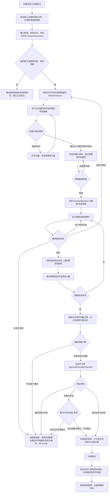
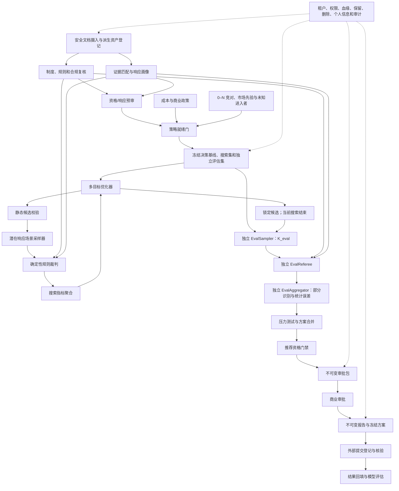

# 标策 AI 产品需求文档（PRD）

> 基于单一决策单元的规则解析、企业响应核验、合规竞争情景与可审计报价策略仿真系统

| 文档信息 | 内容 |
| --- | --- |
| 文档版本 | V1.3 |
| 文档状态 | 内部评审稿 |
| 产品形态 | Web 决策辅助系统 |
| 修订日期 | 2026-08-13 |
| 前序版本 | V1.2，作为本轮评审基线保留，不静默覆盖 |
| 修订依据 | V1.2 逐步逻辑核查、算法公式复核、流程状态审查及数据合规审查 |
| 适用读者 | 产品、算法、前端、后端、招投标、商务、技术、财务、法务、安全与管理层 |

## 0. V1.3 修订摘要

V1.3 在保留 V1.2 正确原则的基础上，修复会导致实现歧义或错误决策的结构问题：

1. 首期正式范围收敛为“单一决策单元、单轮密封报价”；跨标段和多轮谈判只做识别与阻断告警，不宣称联合最优。
2. 将资格/响应预审与策略就绪检查拆开，消除“预审通过后才生成预审输入”的循环。
3. 将静态候选校验、场景策略评估、推荐资格和商业审批拆为独立对象。
4. 引入 `awardable` 和全部待审查参与者结果集合，修正排名频率上下界。
5. 未建立审查结果概率模型时只输出部分识别区间；不得从上下界直接校准出唯一概率。
6. 明确定义最终可行报价集合、零分母处理、共同冻结场景、独立评估集和蒙特卡洛不确定性。
7. 分开项目会计利润、项目 NPV、投标决策期望 NPV、期望收益、CVaR 和风险调整效用。
8. 商业审批前冻结不可变审批包，并在审批提交时原子校验其适用性。
9. 补齐 No-Bid、撤回、取消、提交失败、获授、落标、否决及重新开启等生命周期。
10. 将真实数据处理所需的最低安全、权限、恶意文件隔离、审计、删除和外部模型控制前置到 MVP-A。
11. 将个人信息处理基础、敏感信息影响评估、跨境、权利请求、安全事件和受托处理纳入产品 Gate。
12. 把质量指标拆为强制门槛和观察指标，并绑定阶段、评估协议、责任人和证据。

---

## 1. 产品概述

### 1.1 一句话定义

标策 AI 将当前决策单元的采购规则解析为可执行且经人工确认的规则集，将本公司材料映射为可核验证据和固定响应方案，并利用经审核的竞对资料或市场先验构造不确定竞争情景，在确定性裁判约束下搜索报价，为企业提供可解释、可复现、可审批的投标决策参考。

### 1.2 产品需要回答的问题

1. 当前决策单元适用何种制度、采购方式和评标方法？
2. 当前生效文件规定哪些资格、实质性要求、评分、价格和候选人产生规则？
3. 本公司的资格和响应证据是否满足内部准备要求，还缺什么？
4. 响应方案、成本、商业政策和竞争基线是否足以进入正式策略计算？
5. 在声明的竞争情景下，不同报价的有效性、审查风险、排名、经济结果和不确定性如何？
6. 哪些报价满足规则、数据覆盖、风险和公司政策，可以进入审批？
7. 最终选择基于哪个不可变输入快照、模型版本、假设和审批决定？

### 1.3 核心边界

- 具体评审规则由当前生效采购文件决定；全国不存在统一评分表或统一异常低价比例。
- 系统只做企业内部决策辅助，不替代采购人、评标委员会、财务、法务或管理层，不保证中标。
- 多智能体是内部仿真抽象，不代表与真实竞争者互动，不支持报价交换、协调投标、围标或串标。
- 未经合法来源、允许用途、个人信息处理基础和安全审核的数据不得进入计算。
- 生成式模型只能提出制度、条款、证据和解释候选，不得直接执行资格结论、精确评分、舍入或排名。
- 正式提交发生在外部采购平台；本系统只冻结批准方案并登记、核验外部提交结果。

---

## 2. 产品范围与非目标

### 2.1 V1.3 首期正式范围

V1.3 的 MVP-A、MVP-B 和 Pilot 正式决策范围限定为：

- 一个 `DecisionUnit` 独立计算和审批；
- 一次性、单轮、密封报价类采购流程；
- 策略搜索只优化合同报价 (b)；
- 本公司技术、服务、人员和资源形成固定的 `CompanyResponseProfileVersion`；
- 支持 0–N 个实名竞对，并始终保留去重后的未知进入者场景；
- 支持公开招标等单轮流程；具体试点制度和评标方法由 Stage Gate 明确。

### 2.2 仅识别和阻断、暂不优化的范围

系统可以抽取并提示下列规则，但首期不生成联合最优策略：

- 兼投不兼中、组合报价、项目级授标数量或金额上限；
- 跨标段共享资源和产能冲突；
- 竞争性谈判、竞争性磋商等多轮需求或报价变化；
- 技术、服务、人员、资源与报价的联合优化。

一旦当前项目存在会使单标段独立推荐不可执行的跨标段规则，正式策略状态为 `PORTFOLIO_REVIEW_REQUIRED`；存在多轮报价规则时为 `MULTI_ROUND_UNSUPPORTED`。系统只能输出规则与冲突报告，不得把单元级结果标记为项目级联合最优。

### 2.3 后续扩展的准入条件

跨标段能力上线前必须增加 `PortfolioDecisionContextVersion`、联合报价/响应向量、`AwardAllocationScenarioVersion`、项目级可行性裁判、`PortfolioStrategyVersion` 和 `ProjectApprovalPackageSnapshot`。

多轮能力上线前必须增加 `ProcurementRoundVersion`、`OfferVersion`、轮次级规则/响应/成本/审批和最后报价状态机。

### 2.4 非目标

- 不承诺或暗示“必然中标”“稳妥中标”。
- 不获取或使用未公开底价、拟报价、评委信息、商业秘密或非法数据。
- 不将资格条件自动当作评分因素。
- 不把公司不批准描述成投标无效。
- 不把模拟排名第一频率描述成最终获授或签约概率。
- 不允许未确认成本产生正式利润结论。
- 首期不自动创建或提交真实投标文件。

---

## 3. 决策层级、制度与规则

### 3.1 决策层级

```text
ProcurementProject
└── DecisionUnit（标段、包件或独立授标单元）
    ├── ApplicableRegimeVersion
    ├── RuleSetVersion
    ├── CompanyResponseProfileVersion
    ├── CostBaselineVersion
    ├── CommercialPolicyVersion
    └── 独立仿真、策略与审批包
```

项目可以有多个决策单元，但首期每次正式计算只处理一个决策单元。项目级文件可被继承，标段专属文件可以覆盖；优先级、覆盖关系、生效时间和确认人必须留痕。

`CrossLotConstraintVersion` 只在首期完成抽取、人工确认和冲突告警，不进入单标段优化器。只要确认存在不可忽略的跨单元约束，系统阻止项目级组合推荐。

### 3.2 制度识别与正式准入

系统至少识别政府采购货物服务、工程招投标、企业采购和其他采购方式。每个决策单元记录制度体系、管辖地、采购方式、评标方法、政策、依据、生效时间和确认责任人。

模型只能建议；有权责任人发布 `ApplicableRegimeVersion`。制度未知、冲突，或采购流程超出首期支持范围时，只能进入带水印探索或规则报告，不能发布正式策略。

安全摄入并解析招标文件、补遗和项目级规则后，责任人必须发布 `ScopeAssessmentVersion`。其状态为 `SUPPORTED / REVIEW_REQUIRED / UNSUPPORTED`，包含多值原因码、项目/标段影响范围、原文依据、确认人、确认时间及独立适用性状态。项目创建阶段只能生成初步范围提示；只有当前有效且状态为 `SUPPORTED` 的正式范围评估才能放行策略流程。该版本进入 `DecisionBaselineVersion` 和审批包。

### 3.3 规则优先级与合规复核

- 上位规范用于制度分流和合规告警；具体评分仍按当前生效采购文件计算。
- 澄清、补遗和更正按明确的优先级、适用标段和生效时间覆盖旧条款。
- 系统不自行修改疑似违法条款，而是生成 `RuleComplianceReviewVersion`。
- 合规复核状态为 `OPEN / BLOCKING / ACCEPTED_FOR_SIMULATION / RESOLVED / CLOSED`。
- `BLOCKING` 只能运行探索沙盘；法务或被授权责任人完成处置后才能发布正式规则。
- “按原文探索”与“合规风险情景”是两个独立视图，不得同时成为当前正式规则集。

---

## 4. 术语与正交状态

### 4.1 核心术语

| 术语 | 定义 |
| --- | --- |
| 合同报价 | 本公司拟向采购人提交并可能构成合同基础的金额 |
| 评标价 | 合同报价按规则经修正或政策调整后用于评分或排序的金额 |
| 项目预审 | 对本公司资格、响应和证据准备状态的内部核验，不等于正式评审结果 |
| 策略就绪检查 | 对规则、响应、成本、商业政策和市场基线是否足以正式计算的检查 |
| 静态候选校验 | 对具体报价执行与竞对情景无关的确定性规则检查 |
| 场景策略评估 | 聚合逐场景有效性、待审查、排名、经济和不确定性结果 |
| 可授予状态 awardable | 当前场景是否满足产生候选人或授标所需的有效供应商数量、采购流程及其他规则 |
| 部分识别区间 | 未观察或未建模的审查结果下，目标指标可能值的确定性上下界 |
| 蒙特卡洛置信区间 | 有限仿真样本导致的统计误差范围，不等同于部分识别区间 |
| 推荐资格 | 对预审、就绪、静态校验、场景评估和风险接受的聚合门禁，不包含商业审批决定 |

### 4.2 决策与适用性状态

| 对象 | 决策状态 | 独立适用性状态 |
| --- | --- | --- |
| PrecheckAssessmentVersion | PASS / CONDITIONAL / BLOCKED / UNKNOWN | CURRENT / STALE / INVALIDATED |
| StrategyReadinessAssessmentVersion | READY / CONDITIONAL / NOT_READY / UNKNOWN | CURRENT / STALE / INVALIDATED |
| StaticCandidateValidationVersion | VALID / INVALID / INDETERMINATE | CURRENT / STALE / INVALIDATED |
| ScenarioStrategyAssessmentVersion | ASSESSED / PARTIALLY_IDENTIFIED / INDETERMINATE | CURRENT / STALE / INVALIDATED |
| RecommendationEligibilityVersion | ELIGIBLE / ELIGIBLE_WITH_ACCEPTED_RISK / ELIGIBLE_WITH_CONDITIONS / INELIGIBLE / INDETERMINATE | CURRENT / STALE / INVALIDATED |
| ApprovalWorkflowInstance | PENDING / RUNNING / CANCELLED / TIMED_OUT / COMPLETED | CURRENT / EXPIRED / INVALIDATED |
| ApprovalDecisionEvent | APPROVED / CONDITIONAL / REJECTED | CURRENT / EXPIRED / INVALIDATED |

审批决定和历史评估均不可覆盖。上游变化只改变独立适用性投影，原始决定永久保留。

### 4.3 条件和风险接受

所有 `CONDITIONAL` 或带风险状态必须关联：

- `ConditionRequirementVersion`：条件、责任人、证据、截止日、阻断阶段和满足状态；
- `RiskAcceptanceVersion`：风险、指标、接受范围、接受人、有效期和撤销事件。

条件状态为 `OPEN / SATISFIED / WAIVED / FAILED / EXPIRED`，并记录责任人和独立复核人。条件截止时间不得晚于投标截止时间；法定资格缺失、确定性无效和合规红线不得普通豁免。预审附条件可以进入探索；只有政策明确允许且条件不阻断计算时才可进入正式策略计算。仅补充证明既有事实且不改变任何计算输入的条件，才可在复核后激活原附条件审批；改变规则、响应、成本、政策、报价或风险评估的条件关闭必须使审批包失效并重新审批。未完成的提交前条件阻止提交授权。审查风险由场景评估量化，并由授权人显式接受。

### 4.4 数据对象的正交状态

资料和衍生产物不得使用一个枚举混合多个维度：

- `lifecycle_state`：DRAFT / PUBLISHED / ARCHIVED / DELETED，并另存 `effective_from/effective_to`；
- `review_state`：PENDING / APPROVED / NOT_REQUIRED / REJECTED / QUARANTINED；
- `validity_state`：CURRENT / STALE / INVALIDATED；
- `retention_state`：RETAIN / DISPOSITION_DUE / DISPOSITION_RUNNING / DISPOSED；
- 替代关系：`superseded_by_id` 与追加式 `SupersessionEvent`；
- 法务保全：0–N 个 `LegalHoldRecord`，而非单一状态字段。

正式输入准入谓词为：

```text
FormalInputAllowed =
  lifecycle_state = PUBLISHED
  AND effective_from <= now < effective_to（若有）
  AND review_state IN (APPROVED, NOT_REQUIRED)
  AND validity_state = CURRENT
  AND retention_state = RETAIN
  AND purpose/authorization = CURRENT
```

任一条件失败都阻断正式计算。有效保全记录阻止物理删除但不自动授权业务使用；只有有效保全数量为 0 才能物理删除。新结果只有通过显式替代关系才被视为替代旧结果，且替代与失效可以同时存在。

---

## 5. 用户角色、权限与审批责任

| 能力 | 建议责任主体 | 强制控制 |
| --- | --- | --- |
| 制度和规则发布 | 招投标负责人；阻断级合规问题需法务处置 | 建议人与发布人可分离，发布留版本 |
| 文件和证据维护 | 标书专员、技术负责人 | 不得自行批准用途或解除隔离 |
| 竞对资料审核 | 法务/合规或被授权数据责任人 | 来源、用途、期限和个人信息基础齐全 |
| 响应方案发布 | 技术负责人 | 变更后成本与策略失效 |
| 成本基线编制/批准 | 财务编制人/独立财务批准人 | `created_by != approved_by` |
| 商业政策发布 | 管理层或被授权审批委员会 | 权重、阈值和例外均版本化 |
| 审查风险接受 | 招投标、法务、财务或管理层按风险类型配置 | 不得由方案制表人自行接受 |
| 策略商业审批 | 配置的审批人或审批委员会 | 审批对象必须为不可变审批包 |
| 外部提交登记/核验 | 提交人/独立核验人 | `VERIFIED` 状态必须有有效回执、实际报价、文件哈希和独立核验；`DECLARED/FAILED` 可缺失但须记录原因 |
| 保全解除、批量导出 | 法务及第二授权人 | 双人控制 |
| 系统管理 | 系统管理员 | 默认无权查看正文和成本 |

`ApprovalWorkflowVersion` 定义审批顺序、并行/串行关系、金额和风险阈值、角色、maker-checker 约束、超时和升级路径。所有持久化对象的访问都受 `tenant_id + data_domain_id + project/decision_unit scope` 约束。

---

## 6. 产品原则

1. 一个正式计算批次只服务一个受支持的决策单元。
2. 先确认制度和流程范围，再发布规则。
3. 资格/响应预审与策略就绪、候选有效性、场景风险及商业审批分离。
4. 没有证据不自动判满足；没有可信市场先验不输出正式排名频率。
5. 采样器生成潜在响应状态，确定性裁判执行客观评分规则。
6. 所有候选使用相同冻结场景和权重；正式指标由独立评估场景计算。
7. 待审查不被武断判为有效或无效；无概率模型时只输出区间。
8. 合同报价、评标价、收入、成本、项目价值和投标决策价值严格分离。
9. 审批前冻结审批包；审批决定不可覆盖。
10. 数据变化按实际依赖传播，不因创建草稿而使结果过期。
11. 真实敏感资料进入系统前，MVP-A 基础安全门槛必须通过。
12. 系统只登记并核验外部提交，不代替采购平台提交。

---

## 7. 端到端业务流程



任何正式发布、送审、批准、冻结和提交登记操作都重新校验截止时间、时区、上游有效性、条件、权限和适用范围。上游变化发生在审批期间时，当前审批包立即失去适用性，必须生成新包审批。

---

## 8. 功能需求总览

| 编号 | 模块 | 优先级 | 目标阶段 |
| --- | --- | --- | --- |
| FR-01 | 项目、单元、制度、流程范围与规则 | P0 | MVP-A |
| FR-02 | 安全文档摄入与版本治理 | P0 | MVP-A |
| FR-03 | 本公司证据、响应画像与预审 | P0 | MVP-A |
| FR-04 | 成本、商业政策与策略就绪 | P0 | MVP-A / MVP-B |
| FR-05 | 0–N 竞对、市场先验和未知进入者 | P0 | MVP-B |
| FR-06 | 决策基线、场景集和报价空间 | P0 | MVP-B |
| FR-07 | 静态校验、场景裁判和策略评估 | P0 | MVP-B |
| FR-08 | 多目标优化、独立评估与方案合并 | P0 | MVP-B |
| FR-09a | 推荐资格与模拟评估快照 | P0 | MVP-B |
| FR-09b | 审批包、工作流、商业决定与提交授权 | P0 | Pilot |
| FR-10 | 提交登记、结果回填、报告与生命周期 | P0 | Pilot |
| FR-11 | 血缘、失效、删除、审计和保留 | P0 | MVP-A 起累计 |
| FR-12 | 个人信息、外部处理与安全事件 | P0 | MVP-A 起累计 |
| FR-13 | 模型治理、回测、校准与漂移 | P0 | MVP-B 起累计；Pilot 完成校准与漂移准入 |

---

## 9. 详细功能需求

### FR-01 项目、单元、制度、流程范围与规则

- 创建项目和 1–N 个决策单元，记录范围、预算、最高限价、截止时间、时区和跨单元组。
- 安全摄入并解析足以判断流程范围的文件后，发布 `ScopeAssessmentVersion`；初步元数据判断不得替代正式范围门禁。
- 识别制度、采购方式、评标方法、单轮/多轮以及跨标段约束。
- 超出首期范围时输出 `PORTFOLIO_REVIEW_REQUIRED` 或 `MULTI_ROUND_UNSUPPORTED`，禁止正式优化。
- 抽取资格、实质性要求、评分因素、公式、舍入、并列、候选人产生、有效供应商数量、同品牌、异常低价、合同和提交要求。
- 每条规则含原文、文件、页码、章节、优先级、覆盖关系、结构化表达、置信度、确认人和确认时间。
- 只有发布且已生效的制度和规则版本触发正式下游变化；草稿或未来版本不自动使当前结果过期。

### FR-02 安全文档摄入与版本治理

- 支持 PDF、DOCX、XLSX、图片及受控压缩包。
- 在进入解析器前执行 MIME 内容嗅探、恶意软件扫描、宏/脚本禁用、隔离沙箱及权限审核。
- 对压缩包限制解压总大小、文件数、嵌套层级和路径；阻止目录穿越、压缩炸弹、递归归档及伪装类型。
- 解析任务设置超时、CPU/内存限制、有限重试、可重试/不可重试原因和人工录入路径。
- 状态包括 `DOCUMENT_PARSE_FAILED`，持续失败不能通过排除文件绕过关键规则确认。
- 文件记录租户、数据域、主体、标段、哈希、来源、允许用途、个人信息处理基础、密级、共享限制、审核、生效和保留信息。

### FR-03 本公司证据、响应画像与预审

- 企业资料拆为资质、案例、人员、技术、服务、承诺等不可变证据版本。
- 建立规则找证据和证据找规则的双向链接，状态为满足、部分满足、不满足或未知。
- 发布固定的 `CompanyResponseProfileVersion`，包含资格准备、响应方案、客观非价格分输入、主观评审变量区间、证据和有效期。
- `PrecheckAssessmentVersion` 只检查制度/规则可用、主体资格、实质性响应、响应证据及截止前闭环能力，不检查利润或市场数据。
- 输出条件时创建明确的条件任务；阻断或未知只能探索。

### FR-04 成本、商业政策与策略就绪

- `CostBaselineVersion` 统一币种、含税/不含税、可抵扣进项税、周期、履约成本、获授后费用、投标准备成本和现金流口径。
- `CommercialPolicyVersion` 固定利润、现金流、产能、风险、发布覆盖率、最小获授质量、目标权重、合并容差和例外权限。
- 成本编制人与批准人分离；未经批准只允许探索。
- `StrategyReadinessAssessmentVersion` 检查规则、预审、响应、成本、政策、市场先验、数据用途、模型和场景协议是否就绪。
- 无经批准竞对画像或 `MarketPriorVersion` 时，只能进行无概率权重的压力测试，不得输出正式排名频率。

### FR-05 0–N 竞对、市场先验和未知进入者

- 支持 0–N 个实名竞对；资料必须通过来源、用途、保留和个人信息审核。
- 文件主体无法确认时隔离，不得进入画像。
- 画像输出参与、报价、潜在证据/响应状态、主观评审变量、有效性假设、样本覆盖、选择偏差、漂移和数据等级。
- 客观非价格总分不得由画像直接抽样，必须由裁判根据潜在响应状态计算。
- 未知进入者代表排除实名主体后的剩余市场；按主体解析与去重，禁止同一企业同时作为实名和未知参与者。
- 联合采样实名参与集合和未知进入者数量，不默认本公司是唯一有效投标人。

### FR-06 决策基线、场景集和报价空间

- `DecisionBaselineVersion` 冻结规则、响应、成本、政策、竞对/市场画像、未知进入者、模型、时间点和完整 typed input manifest。
- `CandidateSearchSpaceVersion` 由报价上下限、精度、规则/舍入/税务/异常低价跳点和商业探索边界生成。
- 搜索场景集与正式评估场景集相互独立，均在搜索前冻结版本、随机种子、权重、模型及共同随机数规则。
- 所有候选必须使用同一搜索场景和权重；候选确定后只在独立评估集上生成可送审指标。
- 概率场景和压力场景严格分开；主观压力权重不得进入概率分母。

### FR-07 静态校验、场景裁判和策略评估

- `StaticCandidateValidationVersion` 检查报价格式、完整性、最高限价、静态算术修正规则和其他与竞争场景无关的确定条件。
- 场景采样器生成竞对参与、报价、潜在证据/响应状态、主观评分子项和公共评委严格度等潜变量。
- 确定性裁判对所有参与者执行资格、符合性、政策调整、客观得分、主观档位映射、异常低价、候选人产生、舍入、并列和排名。
- 每个场景输出 `awardable`、每个参与者的确定有效/待审查/确定无效/不可确定及全部待审查结果空间。
- `ScenarioStrategyAssessmentVersion` 输出覆盖率、部分识别区间、蒙特卡洛区间、有效样本量、排名分布、失标原因、经济指标和风险。
- 候选自身计算错误不得通过删除该场景提高指标；应标记不可确定并阻止正式发布。批次基础设施失败应重试，超过上限进入 `SIMULATION_FAILED` 并整批阻断。

### FR-08 多目标优化、独立评估与方案合并

首期生成 0–4 个不同且可行的目标方案：

1. 综合情景平衡；
2. 模拟排名下界优先；
3. 第一候选情景经济代理优先；建立获授模型后才能切换为投标决策期望价值优先；
4. 投标决策尾部损失保护。

优化器在搜索集上提出候选并收敛；独立评估集负责正式指标和送审资格，避免样本内挑选偏差。压力测试覆盖成本上浮、竞对降价、响应能力提升、未知进入者、证据失效和规则边界。

两个方案仅在下列条件同时满足时合并：

- 报价差不超过版本化容差；
- 静态校验状态、场景审查类别和推荐资格一致；
- 两点间没有规则、评分、舍入、税务或异常低价跳点；
- 指标向量差在容差内；
- 可行报价集合在两点之间连通。

合并使用完全链接或等价约束：每个合并簇内任意两点都必须满足上述全部条件，最大报价跨度不超过 \(\tau_b\)，最大指标距离不超过 \(\tau_m\)，防止通过连续近邻形成首尾差异过大的链式合并。

若最终可行集合为空，只输出原因和补救方向，不执行最优值函数或伪造方案卡片。

### FR-09a 推荐资格与模拟评估快照

- `RecommendationEligibilityVersion` 聚合当前预审、策略就绪、静态校验、场景评估、条件和风险接受，不包含商业审批结论。
- MVP-B 只生成不可审批、带水印的 `SimulationAssessmentSnapshot`；不产生审批包或商业批准。

### FR-09b 审批包、工作流、商业决定与提交授权

- Pilot Entry Gate（MVP-B 门槛、基础安全/模型治理及法务安全签署）通过后，只有 `ELIGIBLE`、`ELIGIBLE_WITH_ACCEPTED_RISK`，或政策允许送审的 `ELIGIBLE_WITH_CONDITIONS` 能生成影子 `ApprovalPackageSnapshot`。`ELIGIBLE_WITH_CONDITIONS` 必须列明开放条件及各自阻断的计算、冻结或提交阶段。
- 审批包不可变，包含完整输入清单及哈希、方案、独立评估、压力测试、限制、条件、风险接受和报告草稿。
- `ApprovalRequestVersion` 引用审批包并启动 `ApprovalWorkflowInstance`；每一步由 `ApprovalStepInstance` 表达，最终意见写为不可变 `ApprovalDecisionEvent`。`PENDING/RUNNING/CANCELLED/TIMED_OUT` 属于工作流实例，不得写入最终决定对象。
- 审批提交时以事务方式检查审批包仍为 `CURRENT`、条件有效且截止时间未过。
- 上游新版本、撤销、到期或阻断事件使审批包适用性失效，正在进行的审批自动终止，必须重新生成审批包。
- 满足全部提交前条件后生成 `SubmissionAuthorizationVersion`，状态为 `ACTIVE / BLOCKED / EXPIRED`；实际待提交报价、文件或响应与审批包不一致时授权立即阻断。
- 商业拒绝或 No-Bid 不改变采购规则意义上的报价有效性。

### FR-10 提交登记、结果回填、报告与生命周期

- 批准后生成不可变 `DecisionReportSnapshot` 和冻结方案，不直接调用外部采购平台提交。
- `SubmissionRecordVersion` 记录外部平台、提交人、时间、时区、回执、实际报价、实际文件哈希及独立核验状态。
- 外部提交前为 `EXTERNAL_SUBMISSION_PENDING`；提交记录状态为 `DRAFT / DECLARED / VERIFIED / MISMATCH / FAILED / WITHDRAWN`。没有有效回执只能为 `DECLARED`，实际报价、文件或响应与审批包不同必须为 `MISMATCH`，不得标记为已批准提交。
- `ProcurementOutcomeVersion` 记录采购取消/失败、本公司有效性、分项得分、排名、获授/落标/否决、公开竞对结果、来源及 `UNVERIFIED / VERIFIED / CONFLICTING` 核验状态。仅 `VERIFIED` 结果可进入正式回测或校准；冲突来源不得被覆盖。
- 结果公开前冻结的预测才进入前瞻评估；事后重算另存为复盘结果。
- MVP-A 只生成 `PrecheckReportSnapshot`；完整决策报告从审批能力上线后生成。

### FR-11 血缘、失效、删除、审计和保留

- 每个衍生对象保存 `InputManifestItem` 和内容哈希，字段包括 tenant、上游类型/版本、哈希、`dependency_type` 和受影响字段；依赖类型至少为 `COMPUTATIONAL / EVIDENTIAL / POLICY / AUTHORIZATION / PRESENTATIONAL`。
- 只有 `publish_effective/revoke/delete/retention_expired/authorization_withdrawn/purpose_ended/provider_policy_expired/model_policy_effective` 等事件按“事件 × 依赖类型”矩阵传播；创建草稿和单纯冻结快照不触发失效。
- 传播按实际依赖幂等执行，必须同时测试“相关变化传播”和“无关变化不传播”。
- 报告与审批快照的内容哈希、输入引用和历史事件不可改写；载荷独立加密存储，可依法删除或销毁密钥。删除后只保留不含正文和非必要个人信息的墓碑及生命周期事件。撤回、失效和替代由 `ReportLifecycleEvent`、`ReportRevocationEvent`、`ApprovalApplicabilityEvent` 和 `SupersessionEvent` 追加表达。
- OCR 文本、页图、切片、向量、索引、缓存、临时文件、提示词、模型响应、遥测、导出和备份均登记为 `DerivedDataAssetVersion` 与 `ReplicaLocation`。
- `DeletionJob` 先立即阻断逻辑访问，再遍历所有副本和外部处理者。各 `ReplicaLocation` 配置删除 SLA；只有全部必需 `DeletionReceipt` 成功才能完成，部分失败进入重试/升级。在线、索引、缓存、外部处理者和备份分别验收；从备份恢复后必须先重放墓碑，才可开放访问。法务保全只延迟物理删除，不恢复业务可用性。
- 记录 `retention_expires_at`、处置动作、到期任务和保全覆盖；到期自动停止计算使用并传播失效。
- `AuditEvent` 记录 tenant、actor、role、action、对象/版本、request_id、理由、结果、可信时间和哈希链，写入独立不可变存储并定期校验。

### FR-12 个人信息、外部处理与安全事件

- `PersonalDataProcessingRecord` 按目的、数据类别和人员群体记录处理基础、告知版本、来源、期限及同意/撤回证据。
- 无法建立适用处理基础时，不得解析、索引、画像或调用外部模型。
- `PIARecordVersion` 覆盖敏感个人信息、自动化处理、委托、对外提供、公开和其他高风险活动；适用处理开始前必须处于 `APPROVED/CURRENT`。
- `CrossBorderTransferAssessment` 在跨境前核验适用机制、必要告知/同意、接收方和处理区域；跨境默认阻断。
- `ProviderProcessingPolicyVersion` 记录服务商白名单、目的、区域、子处理者、训练禁用、精确保留天数、协议、安全措施、终止返还/删除和删除证明；默认外部模型关闭。
- 外部处理放行谓词为：处理基础当前有效，适用的 PIA 和跨境评估已批准，Provider Policy 已批准且未过期，并且目的、模型、区域和子处理者匹配。zero-retention 只是策略属性，不能单独放行。
- `DataSubjectRequest` 与 `ConsentWithdrawalEvent` 支持查阅、复制、更正、补充、撤回、限制/拒绝处理和删除，并记录身份核验、法定时限与内部 SLA、超时升级、例外、拒绝理由、申诉、下游传播及完成凭证。
- `IncidentPolicyVersion` 固定分级、负责人、隔离时限和监管/个人通知判断时限；`IncidentEvent` 记录隔离、取证、补救、通知、复盘和演练。

任何真实项目资料进入前，`IncidentPolicyVersion` 必须为 `APPROVED/CURRENT` 并完成安全事件桌面演练；任何个人信息进入前，另须 `DSRPolicyVersion` 及适用的 `PIARecordVersion` 为 `APPROVED/CURRENT`。未批准不得以“待产品决策”为由放行真实数据。

### FR-13 模型治理、回测、校准与漂移

- MVP-B 前建立 `DatasetSnapshotVersion`、`FeatureSchemaVersion`、`ModelArtifactVersion`、适用范围、`ModelApprovalVersion`、`ModelDeploymentVersion`、`ModelMonitoringSnapshot`、`ModelIncidentEvent` 和 `RollbackEvent`。Pilot 再增加 `CalibrationArtifactVersion`、前瞻评估和漂移准入。
- 记录代码/镜像摘要、模型权重、依赖锁、随机数算法、数值精度、排序和归约策略。
- 同一确定性规则输入要求逐位一致；统计聚合按协议规定绝对/相对误差容限。
- 第一候选概率只有在建立审查结果概率模型、获得单点场景预测并通过时间隔离校准后才能展示。
- 上下界本身不得被校准函数直接转换成唯一概率。
- 预测在结果公开前冻结；一个 DecisionUnit 只作为一个独立评估单元，并按项目/采购人聚类估计置信区间。

---

## 10. 决策与计算逻辑

### 10.1 变量、场景和共同分母

- \(b\)：本公司合同报价；
- \(r,c\)：冻结的响应方案和成本版本；
- \(K^{search}\)、\(K^{eval}\)：相互独立的搜索场景和正式评估场景；
- \(w_k\ge 0\)，且 \(\sum_k w_k>0\)；
- \(u\in\Omega_k(b)\)：场景 \(k\) 中所有待审查参与者可能的合法审查结果组合。

从目标分布直接抽样时使用等权；使用重要性采样时记录目标密度与提议密度，并令 \(w_k\propto p(k)/g(k)\)。所有候选共享冻结的场景、权重和共同随机数。优化器只读取 \(K^{search}\)；候选锁定后仅用此前未向优化器开放的 \(K^{eval}\) 生成送审指标。评估不通过时必须拒绝方案，或预登记新的搜索实验并创建此前未暴露的新评估集，不得把本批评估结果反馈给当前优化器继续调参。

### 10.2 静态集合与最终可行集合

静态候选集合：

\[
\mathcal B_0=\{b\mid StaticRulePass(b,r)=1\land BaselineCommercialPass(b,r,c)=1\}
\]

正式评估完成后，未校准代理模式和已批准的校准获授模式分别定义：

\[
\mathcal B_{proxy}=\{b\in\mathcal B_0\mid CoveragePass\land P^-_{rank1}\ge p^-_{min}\land ProxyCommercialProfitPass\land ProxyRiskPass\land StressPass\}
\]

\[
\mathcal B_{cal}=\{b\in\mathcal B_0\mid CoveragePass\land P_{candidate1}\ge p_{min}\land AwardChancePass\land CommercialProfitPass\land CVaRPass\land StressPass\}
\]

`ProxyCommercialProfitPass` 至少检查第一候选经济代理下界及政策规定的保守利润门槛。`CommercialProfitPass` 按政策检查 \(E[Y]\)、\(E[NPV^{decision}]\) 和/或 \(P(Margin\ge m_{min}\mid award)\)；任一必需指标为 `UNDEFINED` 即失败。`StressPass` 对强制压力集逐一检查硬约束；压力场景没有概率含义且不得进入概率分母。推荐资格属于方案形成后的门禁，不进入候选可行集合，避免循环依赖。当前模式对应的集合为空时，系统不得执行后续 `argmax/argmin`，只输出“公司政策下无可行方案”。

### 10.3 逐场景裁判与可授予状态

采样器生成每个竞对的潜在状态：

\[
z_{i,k}=(\text{参与},\text{报价},\text{客观证据/响应状态},\text{主观评审变量},\text{公共评委变量})
\]

裁判在每个 \(u\in\Omega_k(b)\) 下重新执行所有门槛、评分、异常低价、候选人产生、并列和排名规则，并计算：

\[
awardable_{k,u}=F(\text{有效供应商数},\text{采购方式},\text{例外规则},\text{候选名单规则})
\]

裁判同时输出 \(eligibleForAward_{A,k,u}\)，表示本公司是否进入规则允许的可授予候选集合。

\[
J_{k,u}(b)=I(awardable_{k,u}=1\land valid_{A,k,u}=1\land rank_{A,k,u}=1)
\]

### 10.4 覆盖率、部分识别区间和统计误差

概率评估场景全集为 \(K_{prob}^{eval}\)。基础设施失败须重试或终止整批；候选自身不可计算不得从分母删除。只有不依赖候选且经协议允许排除的批次级不可用场景进入覆盖率报告：

\[
Coverage=\frac{\sum_{k\in K_{calc}}w_k}{\sum_{k\in K_{prob}^{eval}}w_k}
\]

除非公式明确标注其他集合，本节之后所有正式概率、经济和风险加权和均遍历同一冻结的 \(K_{calc}\)，并以 \(\sum_{k\in K_{calc}}w_k\) 为总体权重；\(N_{eff}\) 也只基于该集合。正式发布仍必须通过 `CoveragePass`。

全部待审查结果下的第一候选部分识别区间为：

\[
P^-_{rank1}=\frac{\sum_{k\in K_{calc}}w_k\min_{u\in\Omega_k(b)}J_{k,u}(b)}{\sum_{k\in K_{calc}}w_k}
\]

\[
P^+_{rank1}=\frac{\sum_{k\in K_{calc}}w_k\max_{u\in\Omega_k(b)}J_{k,u}(b)}{\sum_{k\in K_{calc}}w_k}
\]

有效样本量：

\[
N_{eff}=\frac{(\sum_k w_k)^2}{\sum_k w_k^2}
\]

页面必须分别展示 `[部分识别下界, 上界]` 和对两端点估计的蒙特卡洛置信区间。没有审查结果概率模型时不得产生单点第一候选概率。只有模型能为每个合法结果给出 \(\pi_{k,u}=P(u\mid x_k,b)\)、满足 \(\pi_{k,u}\ge0\) 且 \(\sum_{u\in\Omega_k(b)}\pi_{k,u}=1\)，并经独立验证时，才能计算：

\[
P^{raw}_{candidate1}(b)=\frac{\sum_k w_k\sum_{u\in\Omega_k(b)}\pi_{k,u}J_{k,u}(b)}{\sum_k w_k}
\]

审查结果模型自身校准和第一候选点值校准是两个独立产物。原始点值再用独立冻结样本对应的 `CalibrationArtifactVersion` 校准；不得把 \([P^-,P^+]\) 本身直接输入校准器生成唯一概率。

### 10.5 条件概率与零分母

若已建立审查结果概率 \(\pi_{k,u}\) 和最终获授概率 \(q^{award}_{k,u}=P(\text{最终获授并签约}\mid k,u,\text{候选排名、制度与定标规则})\)，则 `awardable=0`、本公司确定无效或 \(eligibleForAward_{A,k,u}=0\) 时必须有 \(q^{award}_{k,u}=0\)；模型只估计裁判允许范围内的剩余不确定性。先定义归一化获授质量：

\[
Q_{award}(b)=\frac{\sum_k w_k\sum_u\pi_{k,u}q^{award}_{k,u}}{\sum_k w_k}
\]

仅当 \(Q_{award}(b)\ge\varepsilon_{award}\) 时，才计算获授条件下事件 \(G\) 的概率：

\[
P_w(G\mid award)=\frac{\sum_k w_k\sum_u\pi_{k,u}q^{award}_{k,u}I(G_{k,u})}{\sum_k w_k\sum_u\pi_{k,u}q^{award}_{k,u}}
\]

当分母低于 `CommercialPolicyVersion` 的最小有效质量阈值时，结果为 `UNDEFINED`，约束不通过。未建立获授模型时只能使用明确标注的第一候选代理约束，并同时展示上下界。

### 10.6 财务、决策价值与风险

会计收入、履约成本和获授后会计贡献利润为：

\[
R_{exTax}(b)=F_{revenue}(b,\text{tax},\text{pass-through})
\]

\[
C_{fulfillment,k,u}=C_{delivery,k,u}+C_{awardOnly,k,u}
\]

\[
\Pi^{account}_{k,u}=R_{exTax}(b)-C_{fulfillment,k,u}
\]

收入与成本采用匹配的不含税或不可抵扣税后口径，进项税不得重复进入成本。获授后项目现金流价值为：

\[
NPV^{project}_{k,u}=NPV(CF^{in}_{k,u})-NPV(CF^{out}_{k,u})
\]

定义投标决策收益和非负损失：

\[
Y_{k,u,a}(b)=-C_{bid}+a\Pi^{account}_{k,u},\quad a\sim Bernoulli(q^{award}_{k,u})
\]

\[
L_{k,u,a}(b)=\max(0,-Y_{k,u,a}(b))
\]

投标决策期望 NPV：

\[
E[NPV^{decision}(b)]=-NPV(CF_{bid})+\frac{\sum_k w_k\sum_u\pi_{k,u}q^{award}_{k,u}NPV^{project}_{k,u}}{\sum_k w_k}
\]

对任意函数 \(f\)，CVaR 使用的联合期望为：

\[
E[f]=\frac{\sum_k w_k\sum_u\pi_{k,u}[q^{award}_{k,u}f(k,u,1)+(1-q^{award}_{k,u})f(k,u,0)]}{\sum_k w_k}
\]

条件风险价值：

\[
CVaR_\alpha(L)=\min_\eta\left[\eta+\frac{1}{1-\alpha}E(L-\eta)_+\right]
\]

期望收益与风险调整效用分别展示：

\[
E[Y(b)]=-C_{bid}+\frac{\sum_k w_k\sum_u\pi_{k,u}q^{award}_{k,u}\Pi^{account}_{k,u}}{\sum_k w_k}
\]

\[
U_{risk}(b)=E[Y(b)]-\lambda CVaR_\alpha(L)
\]

`U_risk` 不得命名为期望收益。若商业政策使用获授条件下 CVaR，必须另行命名并明确条件分母；风险准备金已经进入场景成本时不得再次进入损失惩罚。

没有经过验证的 \(\pi_{k,u}\) 和 \(q^{award}_{k,u}\) 时，不输出期望收益点值。第一候选情景经济代理输出：

\[
\widetilde E\Pi^-=-C_{bid}+\frac{\sum_k w_k\min_{u\in\Omega_k(b)}[J_{k,u}(b)\Pi^{account}_{k,u}]}{\sum_k w_k}
\]

\[
\widetilde E\Pi^+=-C_{bid}+\frac{\sum_k w_k\max_{u\in\Omega_k(b)}[J_{k,u}(b)\Pi^{account}_{k,u}]}{\sum_k w_k}
\]

最小值和最大值作用于完整乘积，以覆盖第一候选但亏损的场景；该指标不称为统计期望利润。

### 10.7 多目标方案

在当前模式对应的非空可行集合上定义。未校准时将以下 \(\mathcal B\) 替换为 \(\mathcal B_{proxy}\)，校准且获授模型获批后替换为 \(\mathcal B_{cal}\)：

\[
b_{rank}=\arg\max_{b\in\mathcal B}P^-_{rank1}(b)
\]

\[
b_{value}=\arg\max_{b\in\mathcal B}E[Y(b)]
\]

\[
b_{protect}=\arg\min_{b\in\mathcal B}CVaR_\alpha(L(b))
\]

综合情景平衡方案定义为：

\[
b_{balanced}=\arg\max_{b\in\mathcal B}\left[aZ(P_{candidate})+\beta Z(Value)+\gamma Z(RobustMargin)-\delta Z(ReviewRisk)-\epsilon Z(CVaR)\right]
\]

其中未校准模式分别使用 \(P^-_{rank1}\) 和 \(\widetilde E\Pi^-\)，校准模式使用经批准的第一候选概率和投标决策价值。标准化边界及 \(a,\beta,\gamma,\delta,\epsilon\ge0\)、权重和为 1 均由运行前的 `CommercialPolicyVersion` 固定。

获授模型未上线时，价值目标改为 \(\arg\max_{b\in\mathcal B_{proxy}}\widetilde E\Pi^-(b)\)，保护目标使用政策明确定义的最坏情景投标决策损失 CVaR，并在方案名称中显式标注“代理”。同一方案不得混用未校准代理值和校准获授指标。

---

## 11. 核心数据对象

| 对象组 | 核心对象 |
| --- | --- |
| 项目与规则 | ProcurementProject、DecisionUnit、ApplicableRegimeVersion、RuleSetVersion、RuleClauseVersion、RuleComplianceReviewVersion、CrossLotConstraintVersion |
| 文件与派生物 | SourceDocumentVersion、DerivedDataAssetVersion、ReplicaLocation、ParseJobVersion |
| 公司响应 | CompanyEvidenceVersion、EvidenceMatchVersion、CompanyResponseProfileVersion、PrecheckAssessmentVersion、ConditionRequirementVersion |
| 商业输入 | CostBaselineVersion、CommercialPolicyVersion、StrategyReadinessAssessmentVersion |
| 竞争与场景 | Competitor、CompetitorSourceVersion、CompetitorProfileVersion、MarketPriorVersion、UnknownEntrantProfileVersion、ScenarioSetVersion |
| 搜索与评估 | DecisionBaselineVersion、CandidateSearchSpaceVersion、CandidateStrategyVersion、StaticCandidateValidationVersion、SimulationBatchVersion、ScenarioOutcome、ScenarioStrategyAssessmentVersion |
| 决策与审批 | ScopeAssessmentVersion、RiskAcceptanceVersion、RecommendationEligibilityVersion、SimulationAssessmentSnapshot、ApprovalWorkflowVersion、ApprovalRequestVersion、ApprovalWorkflowInstance、ApprovalStepInstance、ApprovalPackageSnapshot、ApprovalDecisionEvent、ApprovalApplicabilityEvent、SubmissionAuthorizationVersion |
| 提交与结果 | SubmissionRecordVersion、ProcurementOutcomeVersion、DecisionUnitLifecycleEvent、PrecheckReportSnapshot、DecisionReportSnapshot、ReportLifecycleEvent、ReportRevocationEvent |
| 模型治理 | DatasetSnapshotVersion、FeatureSchemaVersion、ModelArtifactVersion、CalibrationArtifactVersion、EvaluationProtocolVersion、ModelApprovalVersion、ModelDeploymentVersion、ModelMonitoringSnapshot、ModelIncidentEvent、RollbackEvent |
| 数据治理 | PersonalDataProcessingRecord、LegalBasisEvidence、NoticeConsentRecord、ConsentWithdrawalEvent、PIARecordVersion、CrossBorderTransferAssessment、ProviderProcessingPolicyVersion、DataSubjectRequest、DSRPolicyVersion、IncidentPolicyVersion、IncidentEvent、LoadProfileVersion |
| 血缘与处置 | InputManifestItem、DataLineageEdge、InvalidationEvent、SupersessionEvent、RetentionDispositionJob、LegalHoldRecord、LegalHoldOverride、DeletionJob、DeletionReceipt、AuditEvent、TombstoneRecord |

所有持久化对象、索引、对象存储键、队列消息、缓存、审计和血缘边强制携带 `tenant_id` 与 `data_domain_id`；跨租户依赖由复合外键或等效底层策略阻断，不能只依赖页面权限。

---

## 12. 逻辑架构



---

## 13. 当前 Demo 能力边界

当前 Demo 仍为纯前端、单场景启发式交互原型：文件仅登记元数据，不读取正文；规则、画像和成本均为预置模板；竞对为固定 B/C/D；所谓概率是 Softmax 份额；所谓论证区间是固定价差；没有真实 OCR、仿真、审批、权限、审计、血缘或数据删除。

Demo 必须继续使用“演示性胜出权重”“模拟策略”“固定价差演示区间”等名称，并显著标注不得用于真实投标。V1.3 的上述后台逻辑均属于后续研发目标，不得由上传控件或静态卡片暗示已经实现。

---

## 14. 非功能、安全与合规要求

### 14.1 可解释、可复现与审计

- 正式规则、裁判结果、方案、审批包和报告均可追溯到全部上游版本。
- 确定性计算同输入逐位一致；统计结果满足评估协议的数值容差。
- 人工覆盖记录覆盖前后差异、理由、操作者、审批人和有效期。
- 审计写入失败时，敏感正文查看、下载、导出、发布、覆盖、审批、权限/用途审批、隔离解除、外部模型调用、保全解除和删除均失败关闭；只允许不涉及敏感数据的健康检查降级运行。
- 审计完整性定期验证，并可从独立不可变存储恢复。

### 14.2 MVP-A 前置安全门槛

任何真实项目或个人信息进入 MVP-A 前必须具备：

- 企业身份认证；管理员、法务、财务和审批角色启用 MFA；
- 传输和存储加密、密钥隔离；
- tenant/project/decision-unit 隔离、最小 RBAC 和 maker-checker；对应授权用例 100% 通过；
- 跨租户 CRUD、对象存储、搜索、向量、缓存、队列和血缘负向用例 100% 拒绝；
- 文件沙箱、内容嗅探、病毒与压缩攻击防护；
- 恶意文件验收样本 100% 阻断；
- 查看、下载、导出、发布、审批和外部模型调用审计；
- 派生资产登记、保留到期、删除和法务保全基本闭环；
- 外部模型默认关闭；只允许满足 FR-12 完整放行谓词的调用；
- 无未处置 Critical 漏洞；跨租户、远程代码执行和数据外泄类 High 不可豁免；
- 数据备份、恢复及个人信息事件桌面演练；
- 正常删除、部分副本失败重试、保全覆盖、保全解除和备份恢复后墓碑重放五类演练通过。

Production 在此基础上增加规模化租户隔离测试、渗透测试、高可用、灾备、审计恢复、模型回滚和正式 SLO，而不是首次补安全基础能力。

### 14.3 性能与恢复口径

`LoadProfileVersion` 固定环境、起止点、网络是否计时、冷/热启动、文件构成、并发、运行次数、P95/P99 和错误率。阶段指标必须绑定该版本。

- MVP-A：100 MB 文件接收状态 P95 ≤5 秒；200 页原生文本初稿 P95 ≤10 分钟；200 DPI 扫描件 OCR 初稿 P95 ≤20 分钟。
- MVP-B：10,000 个评估场景、A 加最多 10 个竞对的单候选评估 P95 ≤60 秒；200 个候选搜索 P95 ≤5 分钟。
- Pilot：完整审批包和报告生成 P95 ≤30 秒，并完成影子负载验证。
- Production：月可用性不低于 99.9%；必须已有批准的具体 RPO/RTO，并以恢复实测证明，而非仍列为待定项。

---

## 15. 质量、统计与正确性指标

### 15.1 强制门槛 Mandatory Gate

| 阶段 | 强制指标 |
| --- | --- |
| MVP-A | 支持范围内硬性条款召回率 ≥98%、准确率 ≥95%，召回率 95% CI 下限 ≥95%；原文定位 ≥99%；规则公式、边界、舍入和并列金标用例 100% 通过；无证据自动判满足 0 次；财务复算在规定精度内 100% 一致；基础安全 Gate 全部通过；14.3 对应 LoadProfileVersion 的错误率与性能阈值通过 |
| MVP-B | 裁判在有效性、候选人产生、异常低价和并列金标用例 100% 一致；可枚举场景的权重聚合与手算一致；正式方案硬约束违规 0 个；压力场景进入概率分母 0 个；优化器相对穷举网格的 objective regret 不超过协议容差；相同冻结环境结果满足复现要求；Coverage ≥99.5%，N_eff 达到预登记阈值，排名频率 95% MC 区间半宽 ≤1 个百分点；14.3 性能阈值通过。否则只能探索，不能生成推荐资格 |
| Pilot | 冻结预测早于结果公开；训练/测试按时间隔离；一个 DecisionUnit 为一个独立评估单元；概率和区间指标达到批准的 `EvaluationProtocolVersion`；完成一个完整采购周期影子运行及联合签署 |
| Production | 跨租户读取、搜索、导出、缓存和血缘负向用例 100% 拒绝；无未接受的严重/高危安全问题；删除、保全、事件、恢复、审计篡改检测和模型回滚演练通过；达到批准 SLO/RPO/RTO |

### 15.2 Pilot 统计协议

`EvaluationProtocolVersion` 固定独立样本、项目/采购人聚类、时间外推、基线、ECE 分箱、Bootstrap 方法、置信区间和缺失结果处理。

- 报价点标准化 MAE 相对预先声明基线改善的 95% CI 下限大于 0；如使用非劣路径，必须在评估前冻结业务依据和数值 margin，评估后不得批准；
- 目标 80% 报价区间点覆盖率必须为 75%–85%，并同时报告覆盖率 CI、WIS 和平均宽度，不以无限加宽换覆盖；
- 第一候选概率至少需要 100 个前瞻独立单元且正负各不少于 20；Brier Score 相对基线改善的 95% CI 下限大于 0，ECE ≤0.08，分箱方案须预先冻结；
- 样本不足、结果缺失偏差过高或审查结果模型未建立时，不得显示校准点概率。

### 15.3 观察指标 Observation Metric

观察但不单独作为准入门槛：规则核对工时、缺口关闭周期、审批周期、报告采用率、实际贡献利润偏差、No-Bid 质量、数据新鲜度和用户纠错率。中标率不作为唯一成功指标。

所有强制门槛必须绑定阶段、适用制度、负责人、证据、评估协议及 `waiver_policy=PROHIBITED/ALLOWED`。跨租户隔离、个人信息处理基础、审计绕过、硬规则或财务计算错误、无证据判满足和违规数据使用一律 `PROHIBITED`；其他允许豁免项必须记录补偿控制、批准人和到期复验。

---

## 16. 路线图与 Stage Gate

| 阶段 | 累计交付 | 阻断性准入 | 允许用途 |
| --- | --- | --- | --- |
| Demo | 当前纯前端交互、固定模板与 B/C/D | 边界文案、模拟水印、不得暗示解析正文或真实概率 | 产品交互评审 |
| MVP-A | 单标段/单轮制度与规则、真实安全摄入、证据、响应、预审、成本基础、血缘和 Precheck 报告 | 第14.2节基础安全 + 第15.1节 MVP-A 门槛；跨标段/多轮只告警 | 内部预审与人工核对，不输出竞对概率建议 |
| MVP-B | 策略就绪、0–N 竞对、市场先验、基础模型治理、冻结场景、确定性裁判、优化、独立评估、方案合并、推荐资格和不可审批模拟快照 | 第15.1节 MVP-B 门槛；无可信概率基线时只压力测试 | 受控内部试用，输出模拟频率区间，不生成商业审批 |
| Pilot Entry | 启用影子审批包、商业审批、提交授权、外部提交登记、结果回填、校准与漂移治理、前瞻评估和系统集成 | MVP-B 门槛已通过；基础安全/模型治理有效；招投标、财务、法务与安全批准试点范围 | 仅限影子运行和受控人工决策，不作为 Production 准入已完成 |
| Pilot Exit | 完整影子周期和前瞻评估完成 | 第15.1与15.2节 Pilot 门槛、完整影子周期及联合签署 | 作为进入 Production 的累计门槛 |
| Production | 规模化安全、高可用、灾备、正式审计/删除/事件响应、模型注册和 SLO | Pilot Exit + 第15.1节 Production 门槛 + 明确且实测的 RPO/RTO | 正式企业内部决策辅助，仍不自动外部提交 |

前一阶段未通过不得处理下一阶段允许的数据或用途。只有标记 `ALLOWED` 的 Gate 才能申请 waiver，并必须记录范围、补偿控制、批准人、到期日和复验计划。

---

## 17. 决策单元生命周期

```text
DRAFT
→ DOCUMENTS_PARSING
→ REGIME_AND_SCOPE_PENDING
  ├─→ PORTFOLIO_REVIEW_REQUIRED / MULTI_ROUND_UNSUPPORTED
  └─→ RULES_PENDING_CONFIRMATION
      → EVIDENCE_MATCHING
      → PRECHECK_PENDING
        ├─→ PRECHECK_BLOCKED / PRECHECK_UNKNOWN → REMEDIATION
        └─→ PRECHECK_PASSED / PRECHECK_CONDITIONAL
            → STRATEGY_READINESS_PENDING
              ├─→ NOT_READY → REWORK
              └─→ STRATEGY_READY / STRATEGY_READY_WITH_CONDITIONS
                  → COMPUTING
                    ├─→ SIMULATION_FAILED → REWORK
                    ├─→ NO_FEASIBLE_STRATEGY → NO_BID 或 REWORK
                    └─→ RECOMMENDATION_REVIEW
                        → ELIGIBILITY_PENDING
                          ├─→ INELIGIBLE / INDETERMINATE → NO_BID 或 REWORK
                          └─→ ELIGIBLE / ELIGIBLE_WITH_ACCEPTED_RISK / ELIGIBLE_WITH_CONDITIONS
                        → APPROVAL_PACKAGE_FROZEN
                        → APPROVAL_PENDING
                          ├─→ REJECTED → NO_BID 或 REWORK
                          ├─→ PACKAGE_INVALIDATED → REWORK
                          ├─→ APPROVED_CONDITIONAL → CONDITION_CLOSURE
                          │     ├─→ INPUT_CHANGED / PACKAGE_INVALIDATED → REWORK
                          │     └─→ EVIDENCE_ONLY_CONDITION_SATISFIED → SUBMISSION_AUTHORIZED
                          └─→ APPROVED → SUBMISSION_AUTHORIZED
                              → DECISION_FROZEN
                              → EXTERNAL_SUBMISSION_PENDING
                              → SUBMISSION_DECLARED
                                ├─→ SUBMISSION_MISMATCH / SUBMISSION_FAILED / WITHDRAWN
                                └─→ SUBMISSION_VERIFIED
                                    → OUTCOME_PENDING
                                      ├─→ OUTCOME_UNVERIFIED / OUTCOME_CONFLICTING → OUTCOME_PENDING
                                      └─→ OUTCOME_VERIFIED
                                          ├─→ AWARDED / LOST / DISQUALIFIED
                                          └─→ CANCELLED / PROCUREMENT_FAILED
                                          → CLOSED → ARCHIVED
```

采购取消可从任意非终态进入 `CANCELLED`。补遗、截止时间延长或采购恢复通过 `DecisionUnitLifecycleEvent` 生成 `REOPENED`，并写明前态、后态、原因、操作者、时间、依据和最早受影响阶段，不覆盖历史。`NO_BID`、`WITHDRAWN`、`CANCELLED` 等是合法业务终态，不强迫进入 REWORK。

---

## 18. 失效传播规则

- 规则发布并生效：仅其实际下游规则匹配、响应画像、预审、基线、仿真、方案和审批包变 `STALE`。
- 证据到期或撤销：从受影响匹配开始传播；无关资格和竞对对象不变。
- 成本或商业政策生效：策略就绪、搜索/评估、方案、审批包和报告适用性过期；资格预审不变。
- 竞对资料隔离：相关画像、场景和结果失效；若仍有批准的市场先验可重建基线，否则只允许压力测试。
- 普通模型政策生效：进行中的适用产物按政策转 `STALE`；冻结历史报告保持 as-of；新结果通过 `superseded_by_id/SupersessionEvent` 显式建立替代关系，不改变旧结果原有有效性事实。
- 原文及派生资产删除：依赖产物失效；快照不修改，通过生命周期事件标注其基于已删除数据且不可继续使用。
- 审批包任何上游变化：包适用性立即失效，审批不得继续提交。

每条规则由 `DataLineageEdge.dependency_type` 驱动，不以硬编码对象列表作为唯一实现依据。

---

## 19. 主要风险与控制

| 风险 | 控制 |
| --- | --- |
| 单标段结果被当成跨标段联合最优 | 明确首期范围，跨标段命中即阻断项目级推荐 |
| 多轮采购被误用单轮报价模型 | 流程范围识别和 `MULTI_ROUND_UNSUPPORTED` |
| 预审、就绪、有效性和审批混用 | 六类独立门禁与适用性状态 |
| 待审查竞对改变我方排名 | 对所有待审查结果重新裁判并输出区间 |
| 有效供应商不足却将 A 记第一 | `awardable` 进入排名指标 |
| 优化样本内选择偏差 | 搜索集与独立评估集分离 |
| 客观分被随机生成或重复计分 | 采样潜在响应，裁判确定性赋客观分 |
| 零获授质量使条件利润约束虚假通过 | 零分母返回 `UNDEFINED` 并阻断 |
| 审批期间输入变化 | 审批前冻结包、提交时原子校验 |
| 真实敏感数据早于安全能力进入 | MVP-A 基础安全前置 Gate |
| 删除原文但派生物仍存在 | 全副本登记、删除任务和完成凭证 |
| Demo 被用于真实项目 | 模拟水印、能力边界和审批导出阻断 |

---

## 20. 待产品评审决策

1. MVP-A 首个试点制度、行业、采购方式和评标方法。
2. 哪些跨标段规则触发阻断，哪些仅作不影响独立推荐的提示。
3. 经法务批准的竞对数据和市场先验来源白名单。
4. 公司对预审附条件、审查风险接受和商业审批的责任矩阵。
5. `CommercialPolicyVersion` 的覆盖率、最小获授质量、概率/风险阈值、目标权重和方案合并容差。
6. 未建立获授模型时，UI 采用“第一候选情景经济代理区间”还是更保守文案。
7. 外部模型白名单、处理区域、保留天数、子处理者和跨境默认策略。
8. 各类副本删除 SLA、个人权利请求 SLA 和安全事件响应时限的企业目标值；适用法律上限和 MVP-A 前完成批准属于固定门槛，不因本项待决策而延期。
9. Pilot 的独立样本目标、基线、ECE 协议和允许的统计非劣界。
10. Production 的具体 SLO、RPO、RTO、渗透测试标准及风险接受权限。

---

## 附录 A：正式报告强制免责声明

> 本报告仅用于企业内部投标决策辅助，基于指定决策单元、冻结输入、经审核资料和明确模型假设生成。竞对参与、报价、响应、评审结论、候选人产生及最终获授均存在不可观察因素。未建立审查结果概率模型时，排名结果仅为声明情景下的部分识别区间；经校准的第一候选概率也不等同于最终获授或签约概率。本系统不构成中标保证，不替代采购文件核对、外部提交平台、评标委员会或公司有权人员审批。

## 附录 B：版本记录

| 版本 | 日期 | 说明 |
| --- | --- | --- |
| V1.0 | 2026-08-11 | 初版 PRD |
| V1.1 | 2026-08-13 | 对齐竞对资料、自动基线与四策略 Demo |
| V1.2 | 2026-08-13 | 修复制度、门槛、概率命名、财务、架构和阶段验收逻辑 |
| V1.3 | 2026-08-13 | 收缩首期范围，修复流程循环、场景上下界、审批快照、安全合规和可执行验收 |
